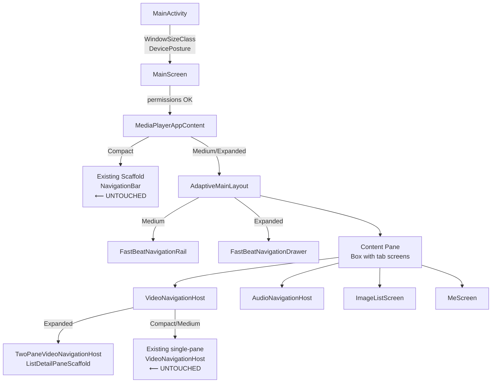

# Design Document: Offline Media Player UI Responsiveness

## Overview

This feature adds full responsive/adaptive layout support to FastBeat (OfflineMediaPlayer), a
Jetpack Compose Android media player. The existing compact (< 600 dp) layout is preserved exactly
as-is; this design covers Medium (600–839 dp) and Expanded (≥ 840 dp) window size classes.

The approach follows Android Material Design 3 and Jetpack WindowManager best practices:
- **`WindowSizeClass`** drives all layout branching decisions from a single source of truth.
- **`FoldingFeature`** from Jetpack WindowManager handles foldable-device Table-Top posture.
- All new layout paths are additive — no modifications to existing Compact-width composables.

### Key Design Decisions

1. **Parameter threading over `CompositionLocal`** for `WindowSizeClass`: threading it explicitly
   from `MainActivity` → `MediaPlayerAppContent` keeps data flow explicit and avoids hidden
   dependencies. A `LocalWindowSizeClass` CompositionLocal is provided as a convenience for deep
   subtrees (e.g., `NowPlayingScreen`) to avoid deep prop drilling.

2. **NavigationRail for Medium, permanent ModalNavigationDrawer for Expanded**: follows the
   Material 3 adaptive navigation guidance. The drawer is always-visible (not dismissible) on
   Expanded width so it acts as a permanent side panel.

3. **Separate adaptive layout composables** (e.g., `AdaptiveMainLayout`,
   `AdaptiveNowPlayingScreen`) rather than in-place `if/when` blocks inside the existing
   composables: keeps compact code paths untouched and new code isolated.

4. **`ListDetailPaneScaffold`** (from `androidx.compose.material3.adaptive`) for the two-pane
   video navigation: reuses the officially supported scaffold rather than building custom Row logic,
   which also handles animated transitions between panes correctly.

5. **`rememberWindowSizeClass()` from `androidx.compose.material3.adaptive`** is the preferred
   API (Material3 adaptive artifact, stable in 1.0.0). Fallback to
   `WindowSizeClass.calculateFromSize()` from `androidx.window` is used in tests.

---

## Architecture

The entire responsive-layout feature is layered on top of the existing code without modifying any
compact-width composable internals.

```
MainActivity
  └── OfflineMediaPlayerTheme
        └── MainScreen (unchanged permission gate)
              └── MediaPlayerAppContent  ← receives WindowSizeClass + DevicePosture
                    ├── [Compact]  → existing Scaffold + NavigationBar  (unchanged)
                    ├── [Medium]   → AdaptiveMainLayout (NavigationRail variant)
                    └── [Expanded] → AdaptiveMainLayout (NavigationDrawer variant)
```

### Data Flow

```
MainActivity
  ├── calculateWindowSizeClass(this)      → WindowSizeClass
  ├── WindowInfoTracker.getOrCreate(this) → FoldingFeature? → DevicePosture
  └── passes both to MediaPlayerAppContent
        ├── Provides LocalWindowSizeClass (CompositionLocal)
        ├── Provides LocalDevicePosture   (CompositionLocal)
        └── all child screens read from locals or receive as params
```

### New Files / Packages

| File | Purpose |
|------|---------|
| `ui/adaptive/WindowSizeExt.kt` | `rememberWindowSizeClass()` wrapper, `widthSizeClass` extension |
| `ui/adaptive/DevicePosture.kt` | `DevicePosture` sealed class, `FoldingFeature` → `DevicePosture` mapper |
| `ui/adaptive/AdaptiveMainLayout.kt` | Medium/Expanded `Row` layout (NavigationRail / NavigationDrawer + content) |
| `ui/adaptive/AdaptiveNavigation.kt` | `FastBeatNavigationRail`, `FastBeatNavigationDrawer` composables |
| `ui/adaptive/AdaptiveGrid.kt` | `adaptiveGridColumns()` and `adaptiveImageCellSize()` helper functions |
| `ui/adaptive/LocalProviders.kt` | `LocalWindowSizeClass`, `LocalDevicePosture` CompositionLocals |
| `ui/adaptive/TwoPaneVideoHost.kt` | `TwoPaneVideoNavigationHost` using `ListDetailPaneScaffold` |

### Mermaid Architecture Diagram



---

## Components and Interfaces

### 1. `WindowSizeExt.kt`

```kotlin
// Classifies raw dp width into the three buckets.
fun WindowWidthSizeClass.toAppWidthClass(): AppWidthClass

enum class AppWidthClass { Compact, Medium, Expanded }

// Helper to get AppWidthClass from a dp value (used in tests).
fun appWidthClassFromDp(widthDp: Float): AppWidthClass
```

- `< 600 dp` → `Compact`
- `600–839 dp` → `Medium`
- `>= 840 dp` → `Expanded`

### 2. `DevicePosture.kt`

```kotlin
sealed class DevicePosture {
    object Normal : DevicePosture()
    data class TableTop(val hingePosition: Rect) : DevicePosture()
}

fun FoldingFeature.toDevicePosture(): DevicePosture
```

- `state == HALF_OPENED && orientation == HORIZONTAL` → `TableTop(bounds)`
- All other cases → `Normal`

### 3. `LocalProviders.kt`

```kotlin
val LocalWindowSizeClass = staticCompositionLocalOf { AppWidthClass.Compact }
val LocalDevicePosture   = staticCompositionLocalOf<DevicePosture> { DevicePosture.Normal }
```

### 4. `AdaptiveMainLayout.kt`

```kotlin
@Composable
fun AdaptiveMainLayout(
    widthClass: AppWidthClass,        // Medium or Expanded
    selectedTab: Int,
    onTabSelected: (Int) -> Unit,
    isVideoPlayingFullscreen: Boolean,
    content: @Composable () -> Unit
)
```

- Renders a `Row`: navigation component on the `start` edge, `content` filling the remainder.
- When `isVideoPlayingFullscreen == true`, the navigation component is hidden (width = 0).
- Passes `widthIn(max = MAX_CONTENT_WIDTH)` + `Modifier.align(Alignment.CenterHorizontally)` to
  `content` when `widthClass == Expanded`.

### 5. `AdaptiveNavigation.kt`

```kotlin
@Composable
fun FastBeatNavigationRail(
    selectedTab: Int,
    onTabSelected: (Int) -> Unit,
    themeColor: Color
)

@Composable
fun FastBeatNavigationDrawer(
    selectedTab: Int,
    onTabSelected: (Int) -> Unit,
    themeColor: Color
)
```

- Both display the same four destinations: Videos, Music, Images, Stats (same icons/labels as the
  existing `NavigationBar`).
- Selection callbacks mirror the existing `NavigationBar` `onClick` behavior (set `selectedTab`).

### 6. `AdaptiveGrid.kt`

```kotlin
/**
 * Returns the fixed column count for LazyVerticalGrid based on window width class.
 * Compact → 2, Medium → 3, Expanded → 4.
 */
fun adaptiveGridColumns(widthClass: AppWidthClass): Int

/**
 * Returns the adaptive minimum cell size for ImageListScreen.
 * Compact → 100.dp, Medium → 130.dp, Expanded → 160.dp.
 */
fun adaptiveImageCellSize(widthClass: AppWidthClass): Dp
```

These are pure functions, making them straightforward to property-test.

### 7. `TwoPaneVideoHost.kt`

```kotlin
@Composable
fun TwoPaneVideoNavigationHost(
    viewModel: PlaybackViewModel,
    libraryViewModel: LibraryViewModel,
    onVideoClick: (MediaFile, List<MediaFile>) -> Unit,
    isSearchVisible: Boolean
)
```

- Uses `ListDetailPaneScaffold` (Material3 adaptive). The list pane shows `VideoFolderScreen` (with
  folder/movie/playlist tabs). The detail pane shows `VideoListScreen` for the selected folder or
  an empty-state placeholder.
- Selection state (`selectedFolderId: String?`) is hoisted inside `TwoPaneVideoNavigationHost` and
  does not leak into `MediaPlayerAppContent`.
- Folder clicks in the list pane update `selectedFolderId`; they do not trigger `navController`
  navigation in Expanded mode.
- When `AppWidthClass` transitions away from `Expanded`, the single-pane `VideoNavigationHost`
  takes over (governed by the `when (widthClass)` branch in `MediaPlayerAppContent`).

### 8. `AdaptiveNowPlayingScreen.kt`

Wraps the existing `NowPlayingScreen` to add the two-column layout path without touching the
original file:

```kotlin
@Composable
fun AdaptiveNowPlayingScreen(
    viewModel: PlaybackViewModel,
    onBack: () -> Unit
) {
    val widthClass = LocalWindowSizeClass.current
    val posture   = LocalDevicePosture.current
    when {
        posture is DevicePosture.TableTop    -> TableTopNowPlayingLayout(viewModel, posture, onBack)
        widthClass != AppWidthClass.Compact  -> TwoColumnNowPlayingLayout(viewModel, onBack)
        else                                 -> NowPlayingScreen(viewModel, onBack = onBack)
    }
}
```

### 9. `AdaptiveMeScreen.kt`

```kotlin
@Composable
fun AdaptiveMeScreen(
    viewModel: PlaybackViewModel,
    posture: DevicePosture,
    ...
) {
    val widthClass = LocalWindowSizeClass.current
    val modifier = if (widthClass == AppWidthClass.Expanded)
        Modifier.widthIn(max = MAX_CONTENT_WIDTH).fillMaxWidth().wrapContentWidth(Alignment.CenterHorizontally)
    else
        Modifier.fillMaxWidth()
    ...
}
```

### 10. `MiniPlayer` Adaptation

The existing `MiniPlayer` composable (inside `AudioLibraryScreen`) already takes a `Modifier`.
The change is:

- When `widthClass == Expanded`, the parent `Box` in the content pane wraps `MiniPlayer` with
  `Modifier.widthIn(max = MAX_CONTENT_WIDTH).align(Alignment.BottomCenter)`.
- On Medium/Compact, the existing modifier is passed unchanged.

### Constants

```kotlin
object AdaptiveLayoutConstants {
    val MAX_CONTENT_WIDTH = 840.dp
    const val MEDIUM_WIDTH_DP = 600
    const val EXPANDED_WIDTH_DP = 840
}
```

---

## Data Models

### `AppWidthClass`

```kotlin
enum class AppWidthClass { Compact, Medium, Expanded }
```

Replaces direct use of `WindowWidthSizeClass` throughout UI code. By introducing our own enum we:
- Decouple UI logic from the Jetpack library type (easier to test).
- Make the three-bucket invariant explicit and enforced at the type level.

### `DevicePosture`

```kotlin
sealed class DevicePosture {
    /** Normal flat or fully-open device. */
    object Normal : DevicePosture()

    /**
     * Foldable in table-top posture:
     *  - FoldingFeature.state == HALF_OPENED
     *  - FoldingFeature.orientation == HORIZONTAL
     *  - hingePosition: the pixel bounds of the hinge in the window coordinate space.
     */
    data class TableTop(val hingePosition: Rect) : DevicePosture()
}
```

`Rect` here is `android.graphics.Rect` (pixel coordinates), later converted to `dp` inside the
layout composable using `LocalDensity`.

### `TwoPaneVideoState`

Internal state held inside `TwoPaneVideoNavigationHost`:

```kotlin
data class TwoPaneVideoState(
    val selectedFolderId: String? = null   // null = show empty/placeholder detail pane
)
```

Not a ViewModel-level state; it is ephemeral UI state that resets when the user leaves the Videos
tab or rotates to a non-Expanded width.

### `NavigationDestination`

Shared definition of the four tab destinations, used by both the compact `NavigationBar` and the
adaptive `NavigationRail`/`NavigationDrawer`:

```kotlin
data class AppNavigationDestination(
    val tabIndex: Int,
    val label: String,
    val selectedIcon: ImageVector,
    val unselectedIcon: ImageVector,
    val contentDescription: String
)

val APP_DESTINATIONS: List<AppNavigationDestination> = listOf(
    AppNavigationDestination(0, "Videos",  Icons.Filled.PlayArrow,  Icons.Outlined.PlayArrow,  "Videos"),
    AppNavigationDestination(1, "Music",   Icons.Filled.MusicNote,  Icons.Outlined.MusicNote,  "Music"),
    AppNavigationDestination(2, "Images",  Icons.Filled.Image,      Icons.Outlined.Image,      "Images"),
    AppNavigationDestination(3, "Stats",   Icons.Filled.Analytics,  Icons.Outlined.Analytics,  "Stats"),
)
```

This single source of truth ensures all three navigation components display identical destinations.

---

## Correctness Properties

*A property is a characteristic or behavior that should hold true across all valid executions of a
system — essentially, a formal statement about what the system should do. Properties serve as the
bridge between human-readable specifications and machine-verifiable correctness guarantees.*

---

### Property 1: Width Classification Covers All Values

*For any* non-negative dp width value, `appWidthClassFromDp(width)` SHALL return exactly one of
`Compact`, `Medium`, or `Expanded` — never null, never an unclassified value — and the result
SHALL be consistent with the boundaries `< 600 dp → Compact`, `600–839 dp → Medium`,
`≥ 840 dp → Expanded`.

**Validates: Requirements 1.3**

---

### Property 2: Navigation Component Selection is Total and Consistent

*For any* `AppWidthClass` value and any `isVideoPlayingFullscreen` boolean, the navigation
component selector function SHALL return exactly one of `{NavigationBar, NavigationRail,
NavigationDrawer, Hidden}`, and:

- `Compact + false` → `NavigationBar`
- `Medium + false` → `NavigationRail`
- `Expanded + false` → `NavigationDrawer`
- `Compact/Medium/Expanded + true` → `Hidden`

**Validates: Requirements 2.1, 2.2, 2.3, 2.7**

---

### Property 3: Tab Selection Equivalence Across Navigation Components

*For any* tab index `i ∈ {0, 1, 2, 3}`, selecting destination `i` via `NavigationBar`,
`NavigationRail`, or `NavigationDrawer` SHALL produce the same resulting `selectedTab` value `i`.
No navigation component shall produce a different tab selection outcome for the same input index.

**Validates: Requirements 2.6**

---

### Property 4: Adaptive Grid Column Count is Monotone and Correct

*For any* `AppWidthClass` value, `adaptiveGridColumns(widthClass)` SHALL return:

- `Compact` → `2`
- `Medium` → `3`
- `Expanded` → `4`

Column count SHALL be strictly monotonically non-decreasing as width class increases
(`Compact ≤ Medium ≤ Expanded`).

**Validates: Requirements 3.1, 3.2, 3.3**

---

### Property 5: Adaptive Image Cell Size is Monotone and Correct

*For any* `AppWidthClass` value, `adaptiveImageCellSize(widthClass)` SHALL return:

- `Compact` → `100.dp`
- `Medium` → `130.dp`
- `Expanded` → `160.dp`

Cell size SHALL be strictly monotonically non-decreasing as width class increases.

**Validates: Requirements 4.1, 4.2, 4.3**

---

### Property 6: NowPlaying Layout Type Matches Width Class

*For any* `AppWidthClass` value and `DevicePosture.Normal`, the `NowPlayingScreen` layout
selector SHALL return:

- `Compact` → `VERTICAL` (single-column)
- `Medium` → `TWO_COLUMN`
- `Expanded` → `TWO_COLUMN`

*For any* `DevicePosture.TableTop`, regardless of `AppWidthClass`, the selector SHALL return
`TABLE_TOP_SPLIT`.

**Validates: Requirements 5.1, 5.2, 10.2**

---

### Property 7: Album Art Size Constraint

*For any* available height `h > 0` (in dp), the computed album art maximum size SHALL equal
`min(h * 0.85f, 400.dp)`. This value SHALL always be `≤ 400.dp` and SHALL always be
`≤ availableHeight * 0.85f`.

**Validates: Requirements 5.3**

---

### Property 8: Max Content Width Applied Only on Expanded

*For any* `AppWidthClass` value, the `maxContentWidthModifier(widthClass)` function SHALL:

- Return a modifier containing `widthIn(max = 840.dp)` **only when** `widthClass == Expanded`.
- Return a modifier with **no** `widthIn(max)` constraint when `widthClass ∈ {Compact, Medium}`.

**Validates: Requirements 7.3, 8.1, 8.2, 8.3**

---

### Property 9: Device Posture Classification is Exhaustive

*For any* combination of `FoldingFeature.State` and `FoldingFeature.Orientation` (or the absence
of a `FoldingFeature`), `FoldingFeature.toDevicePosture()` SHALL return exactly one of
`DevicePosture.Normal` or `DevicePosture.TableTop`. Specifically:

- `(HALF_OPENED, HORIZONTAL)` → `TableTop`
- Any other state/orientation pair → `Normal`
- Absence of `FoldingFeature` → `Normal`

**Validates: Requirements 10.1, 10.5**

---

### Property 10: Table-Top Posture Round-Trip

*For any* `DevicePosture.TableTop` state, transitioning to any non-`TableTop` posture (i.e.,
`DevicePosture.Normal`) SHALL cause the layout selector to return the same value as it would for
the current `AppWidthClass` without any `TableTop` posture — i.e., the standard layout is fully
restored with no residual table-top state.

**Validates: Requirements 10.4**

---

### Property 11: Video Navigation Layout Selection is Total

*For any* `AppWidthClass` value and any current navigation route string, the video navigation
layout selector SHALL return exactly one of `{SINGLE_PANE, TWO_PANE}`:

- `Expanded + "video_folders"` → `TWO_PANE`
- `Compact` → `SINGLE_PANE`
- `Medium` → `SINGLE_PANE`
- `Expanded + any route other than "video_folders"` → `SINGLE_PANE`

**Validates: Requirements 12.1, 12.3**

---

### Property 12: Two-Pane Folder Selection Drives Detail Content

*For any* folder ID `folderId` present in the video library, selecting `folderId` in the two-pane
leading pane SHALL set `TwoPaneVideoState.selectedFolderId == folderId`. The trailing pane SHALL
then display only videos whose `bucketId == folderId`. The mapping `select(folderId) → filter
(video.bucketId == folderId)` SHALL be a consistent function with no side effects on other state.

**Validates: Requirements 12.2**

---

### Property 13: Header Visibility is Determined by Navigation Context

*For any* `(AppWidthClass, hasAdaptiveNav: Boolean)` pair, the `showFastBeatHeader` function SHALL:

- Return `true` only when `AppWidthClass == Compact` (and existing compact visibility conditions
  are met).
- Return `false` when `AppWidthClass ∈ {Medium, Expanded}` and `hasAdaptiveNav == true`.

The section context is provided by the NavigationRail/Drawer label in the adaptive path, making
the header redundant.

**Validates: Requirements 9.2**

---

## Error Handling

### WindowSizeClass Unavailability

If `calculateWindowSizeClass()` throws (e.g., an older device with an unusual Activity subclass),
`MainActivity` catches the exception and defaults to `AppWidthClass.Compact`, ensuring all
existing compact behavior is preserved.

### FoldingFeature Collection Failure

`WindowInfoTracker.getOrCreate(activity).windowLayoutInfo` is collected with
`catch { emit(WindowLayoutInfo(emptyList())) }`. An empty layout info list produces
`DevicePosture.Normal`, so the app falls back to the standard WindowSizeClass-driven layout
(Requirement 10.5).

### Two-Pane Detail Pane: No Folder Selected

When `TwoPaneVideoState.selectedFolderId == null`, the detail pane renders a placeholder
composable (`EmptyDetailPane`) showing a "Select a folder" message. This is always visible,
preventing a blank or null pane.

### Window Size Class Mid-Transition

During multi-window resize or fold/unfold animations, `WindowSizeClass` may change rapidly. All
layout composables use `remember { }` keyed on `widthClass`, so recomposition is idempotent.
`rememberLazyGridState()` is retained across recompositions by key, preserving scroll position
(Requirement 3.5).

### Two-Pane to Single-Pane Transition

When `AppWidthClass` changes from `Expanded` to `Medium` or `Compact` (e.g., user exits
multi-window), `TwoPaneVideoNavigationHost` is replaced by `VideoNavigationHost`. The
`videoNavController` (hoisted in `MediaPlayerAppContent`) retains its back stack, so the user
returns to the `video_folders` destination as expected (Requirement 11.5).

### NowPlayingScreen Overflow Fallback

If the two-column layout cannot accommodate all controls without clipping (detected via
`onGloballyPositioned` overflow check), a boolean flag `fallbackToVertical` is set, and the
existing single-column layout is shown instead (Requirement 5.5).

---

## Testing Strategy

### Dual Testing Approach

This feature uses both **unit/property-based tests** for pure logic functions and
**instrumented/integration tests** for UI behavior verification.

### Property-Based Testing Library

**`kotest-property`** (`io.kotest:kotest-property:5.9.1`) — runs on the JVM, no Android device
needed. Configured for a minimum of **100 iterations per property** using `PropTestConfig(iterations = 100)`.

Add to `app/build.gradle.kts`:
```kotlin
testImplementation("io.kotest:kotest-runner-junit5:5.9.1")
testImplementation("io.kotest:kotest-property:5.9.1")
```

Add to `app/build.gradle.kts` (test options):
```kotlin
tasks.withType<Test> {
    useJUnitPlatform()
}
```

### Unit / Property Tests (`src/test/`)

Pure functions in `ui/adaptive/` are tested with kotest-property. Each test references the design
property it validates.

#### `AppWidthClassTest.kt`

```kotlin
// Feature: offline-media-player-ui-responsiveness
// Property 1: Width Classification Covers All Values
"appWidthClassFromDp classifies all widths correctly" {
    checkAll<Float>(PropTestConfig(iterations = 200)) { width ->
        val absWidth = abs(width)
        val result = appWidthClassFromDp(absWidth)
        when {
            absWidth < 600f  -> result shouldBe AppWidthClass.Compact
            absWidth < 840f  -> result shouldBe AppWidthClass.Medium
            else             -> result shouldBe AppWidthClass.Expanded
        }
    }
}
```

#### `AdaptiveNavigationTest.kt`

```kotlin
// Property 2: Navigation Component Selection is Total and Consistent
"navigationComponentFor returns correct type for all width classes and fullscreen states" {
    checkAll<Boolean>(PropTestConfig(iterations = 100)) { isFullscreen ->
        AppWidthClass.values().forEach { widthClass ->
            val result = navigationComponentFor(widthClass, isFullscreen)
            if (isFullscreen) result shouldBe NavigationComponentType.Hidden
            else when (widthClass) {
                AppWidthClass.Compact  -> result shouldBe NavigationComponentType.BottomBar
                AppWidthClass.Medium   -> result shouldBe NavigationComponentType.Rail
                AppWidthClass.Expanded -> result shouldBe NavigationComponentType.Drawer
            }
        }
    }
}

// Property 3: Tab Selection Equivalence
"all navigation components produce same selectedTab for same index" {
    checkAll(Arb.int(0, 3)) { tabIndex ->
        val viaBar     = simulateNavBarSelect(tabIndex)
        val viaRail    = simulateNavRailSelect(tabIndex)
        val viaDrawer  = simulateNavDrawerSelect(tabIndex)
        viaBar shouldBe viaRail
        viaBar shouldBe viaDrawer
    }
}
```

#### `AdaptiveGridTest.kt`

```kotlin
// Property 4: Adaptive Grid Column Count
"adaptiveGridColumns is monotone and correct" {
    checkAll(Arb.enum<AppWidthClass>()) { widthClass ->
        val cols = adaptiveGridColumns(widthClass)
        when (widthClass) {
            AppWidthClass.Compact  -> cols shouldBe 2
            AppWidthClass.Medium   -> cols shouldBe 3
            AppWidthClass.Expanded -> cols shouldBe 4
        }
    }
}

// Property 5: Adaptive Image Cell Size
"adaptiveImageCellSize is monotone and correct" {
    checkAll(Arb.enum<AppWidthClass>()) { widthClass ->
        val size = adaptiveImageCellSize(widthClass)
        when (widthClass) {
            AppWidthClass.Compact  -> size shouldBe 100.dp
            AppWidthClass.Medium   -> size shouldBe 130.dp
            AppWidthClass.Expanded -> size shouldBe 160.dp
        }
    }
}
```

#### `NowPlayingLayoutTest.kt`

```kotlin
// Property 6: NowPlaying Layout Type
"nowPlayingLayoutType returns correct type for all width classes and postures" {
    checkAll(Arb.enum<AppWidthClass>()) { widthClass ->
        val normalResult    = nowPlayingLayoutType(widthClass, DevicePosture.Normal)
        val tableTopResult  = nowPlayingLayoutType(widthClass, DevicePosture.TableTop(Rect()))
        when (widthClass) {
            AppWidthClass.Compact  -> normalResult shouldBe NowPlayingLayoutType.Vertical
            else                   -> normalResult shouldBe NowPlayingLayoutType.TwoColumn
        }
        tableTopResult shouldBe NowPlayingLayoutType.TableTopSplit
    }
}

// Property 7: Album Art Size Constraint
"albumArtMaxSize is always <= 400.dp and <= availableHeight * 0.85" {
    checkAll(Arb.float(1f, 2000f)) { heightDp ->
        val result = computeAlbumArtMaxSize(heightDp)
        result shouldBeLessThanOrEqualTo 400f
        result shouldBeLessThanOrEqualTo heightDp * 0.85f
    }
}
```

#### `ContentWidthModifierTest.kt`

```kotlin
// Property 8: Max Content Width Applied Only on Expanded
"maxContentWidthModifier applies 840dp constraint only on Expanded" {
    checkAll(Arb.enum<AppWidthClass>()) { widthClass ->
        val hasConstraint = contentWidthConstraintApplied(widthClass)
        when (widthClass) {
            AppWidthClass.Expanded -> hasConstraint shouldBe true
            else                   -> hasConstraint shouldBe false
        }
    }
}
```

#### `DevicePostureTest.kt`

```kotlin
// Property 9: Device Posture Classification
"toDevicePosture classifies all FoldingFeature combinations correctly" {
    // Use example-based table for the sealed combinations
    forAll(
        row(FoldingFeature.State.HALF_OPENED, FoldingFeature.Orientation.HORIZONTAL, true),
        row(FoldingFeature.State.HALF_OPENED, FoldingFeature.Orientation.VERTICAL,   false),
        row(FoldingFeature.State.FLAT,        FoldingFeature.Orientation.HORIZONTAL, false),
        row(FoldingFeature.State.FLAT,        FoldingFeature.Orientation.VERTICAL,   false),
    ) { state, orientation, expectedTableTop ->
        val result = mockFoldingFeature(state, orientation).toDevicePosture()
        (result is DevicePosture.TableTop) shouldBe expectedTableTop
    }
}

// Property 10: Table-Top Posture Round-Trip
"layout reverts to standard after leaving TableTop posture" {
    checkAll(Arb.enum<AppWidthClass>()) { widthClass ->
        val inTableTop  = nowPlayingLayoutType(widthClass, DevicePosture.TableTop(Rect()))
        val afterNormal = nowPlayingLayoutType(widthClass, DevicePosture.Normal)
        val directNormal = nowPlayingLayoutType(widthClass, DevicePosture.Normal)
        afterNormal shouldBe directNormal
    }
}
```

#### `VideoNavigationLayoutTest.kt`

```kotlin
// Property 11: Video Navigation Layout Selection
"videoNavigationLayout returns correct pane mode for all width classes and routes" {
    checkAll(Arb.enum<AppWidthClass>(), Arb.string()) { widthClass, route ->
        val result = videoNavigationLayout(widthClass, route)
        when {
            widthClass == AppWidthClass.Expanded && route == "video_folders" ->
                result shouldBe VideoNavigationLayout.TwoPane
            else ->
                result shouldBe VideoNavigationLayout.SinglePane
        }
    }
}

// Property 12: Two-Pane Folder Selection
"selecting folderId sets state and detail content matches folderId" {
    checkAll(Arb.string(1, 20)) { folderId ->
        val state = TwoPaneVideoState()
        val newState = state.selectFolder(folderId)
        newState.selectedFolderId shouldBe folderId
    }
}
```

#### `HeaderVisibilityTest.kt`

```kotlin
// Property 13: Header Visibility
"showFastBeatHeader is false for Medium/Expanded with adaptive nav" {
    checkAll(Arb.bool()) { hasAdaptiveNav ->
        listOf(AppWidthClass.Medium, AppWidthClass.Expanded).forEach { widthClass ->
            if (hasAdaptiveNav) {
                showFastBeatHeader(widthClass, hasAdaptiveNav, /* other params */ true) shouldBe false
            }
        }
        showFastBeatHeader(AppWidthClass.Compact, false, true) shouldBe true
    }
}
```

### Integration / Instrumented Tests (`src/androidTest/`)

These tests run on a device/emulator and verify UI behavior. They use `ComposeTestRule` and
Espresso. Each test is a single example, not property-based.

| Test | Covers |
|------|--------|
| `NavigationRailDisplayTest` | Medium width → NavigationRail visible, NavigationBar absent |
| `NavigationDrawerDisplayTest` | Expanded width → NavigationDrawer visible |
| `TwoPaneVideoTest` | Expanded width on Videos tab → two-pane layout; selecting folder shows video list in detail pane |
| `NowPlayingTwoColumnTest` | Medium width → two-column layout renders without overflow |
| `TableTopPostureTest` | Simulated HALF_OPENED + HORIZONTAL → split layout on NowPlayingScreen |
| `GridColumnCountTest` | Grid shows 3 columns on Medium, 4 on Expanded |
| `CompactPreservationTest` | All compact-width behaviors (2-col grid, bottom nav, full-width MiniPlayer) preserved |
| `DeepLinkNavigationTest` | Deep link to audio player navigates to NowPlayingScreen on all window sizes |

### Smoke Tests

| Check | How |
|-------|-----|
| WindowSizeClass is present in composition tree | `LocalWindowSizeClass.current != null` in any composable |
| No WindowSizeClass checks in compact-only composables | Static code analysis / lint rule |
| FoldingFeature fallback produces Normal posture | Unit test: empty WindowLayoutInfo → DevicePosture.Normal |
| VideoPlayerScreen always uses `fillMaxSize()` | Code review / lint check on root Modifier |

---

## Dependency Addition

Add to `app/build.gradle.kts`:

```kotlin
// Jetpack WindowManager — WindowSizeClass + FoldingFeature
implementation("androidx.window:window:1.3.0")

// Material3 Adaptive — rememberWindowSizeClass, ListDetailPaneScaffold
implementation("androidx.compose.material3.adaptive:adaptive:1.0.0")
implementation("androidx.compose.material3.adaptive:adaptive-layout:1.0.0")
implementation("androidx.compose.material3.adaptive:adaptive-navigation:1.0.0")

// Kotest property testing (JVM unit tests)
testImplementation("io.kotest:kotest-runner-junit5:5.9.1")
testImplementation("io.kotest:kotest-property:5.9.1")
```

`androidx.window:window:1.3.0` is compatible with `minSdk = 26` and `compileSdk = 36`.
`androidx.compose.material3.adaptive:1.0.0` requires Compose BOM `2024.09.00` or later; the
existing BOM reference in `build.gradle.kts` should be updated to at least `2024.09.00`.

---

*Design completed. Requirements document is at `.kiro/specs/offline-media-player-ui-responsiveness/requirements.md`.*
