# ⏱️ FastBeat

<div align="center">

[](https://developer.android.com)
[](https://kotlinlang.org)
[](https://developer.android.com/jetpack/compose)
[](LICENSE)

**The Ultimate Premium Offline Media Player for Android**

[Features](#-features) • [Quick Start](#-quick-start) • [Development](#-development) • [Pre-Push Checklist](#-pre-push-checklist) • [Architecture](#-architecture) • [Contributing](#-contributing)

</div>

---

## 🌟 What is FastBeat?

FastBeat is a powerful, modern, and beautifully designed offline media player built from the ground up to deliver a premium experience for both video and audio. Built with the latest Android technologies (Kotlin, Jetpack Compose, Media3, Room, Hilt), it provides a seamless and immersive way to enjoy your local media without any internet connection.

Whether you're watching high-definition movies with advanced gesture controls and Picture-in-Picture mode, or listening to your music library with a smart queue system and rich analytics, FastBeat is designed to be your all-in-one media companion. It respects your privacy by remaining 100% offline, ensuring your data never leaves your device.

### Why FastBeat?

| Traditional Media Players | FastBeat Solution |
|---------------------|------------------------|
| Clunky, outdated UI | **Modern, Fluid Jetpack Compose UI** |
| Ad-heavy and online-focused | **100% Offline & Ad-Free Experience** |
| Basic playback controls | **Advanced Gestures, PiP, & Smart Queue** |
| No insights into habits | **Rich Analytics & Activity Dashboard** |

---

## ✨ Features

### 🎬 Advanced Video Player
- **High-Performance Playback** — Smooth offline video playback powered by AndroidX Media3 (ExoPlayer).
- **Intuitive Gestures** — Swipe left/right for brightness/volume, swipe horizontally to seek.
- **Picture-in-Picture (PiP)** — Continue watching in a floating window while using other apps.
- **Multi-Track Support** — Easily switch between audio tracks and subtitle tracks.

### 🎧 Immersive Audio Experience
- **Smart Queue System** — Persistent playback queue that remembers your position across restarts.
- **Infinite Playback** — Auto-refills with shuffled tracks when your queue ends.
- **Rich Library Management** — Advanced sorting and real-time search across tracks, albums, and playlists.
- **Mini Player** — Always-visible persistent player bar with gradient progress.

### 📊 "Me" Dashboard (Analytics)
- **Real-time Stats** — Track your daily, weekly, and monthly listening time.
- **Activity Streaks** — Maintain your daily listening streak.
- **Smart Insights** — Discover your most played tracks and current obsessions.
- **Playback History** — Complete log of your recently played media.

### 🖼️ Rich Image Gallery
- **Instant Gallery** — View all device images in a sleek, staggered grid.
- **Fullscreen Viewer** — Edge-to-edge, swipeable image viewing experience.
- **Scoped Storage Support** — Safely delete or manage media with Android 11+ compatibility.

### 🎨 Premium Theming
- **Curated Themes** — Choose from Amber Horizon, Digital Waves, or Eco Frequency.
- **Dynamic Dark Mode** — Full support for Light and Dark modes across all themes.
- **Animated Transitions** — Smooth navigation and UI interactions.

### 📁 Smart Organization
- **Auto-Grouping** — Videos automatically organized by folders.
- **Continue Watching** — Resume unfinished videos exactly where you left off.
- **Fast Thumbnails** — Background-cached video thumbnails for instant browsing.

---

## 📸 Showcase

<div align="center">
  <p><strong>Experience the Premium Interface</strong></p>

  <table>
    <tr>
      <td align="center"><strong>Video Player</strong></td>
      <td align="center"><strong>Audio Player</strong></td>
      <td align="center"><strong>Analytics</strong></td>
    </tr>
    <tr>
      <td>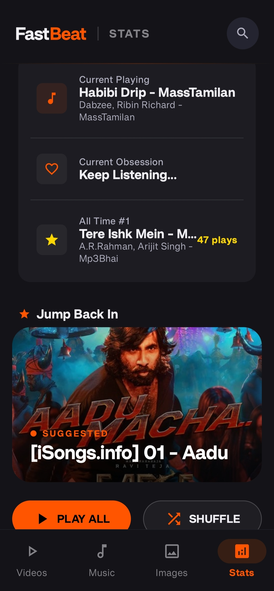</td>
      <td>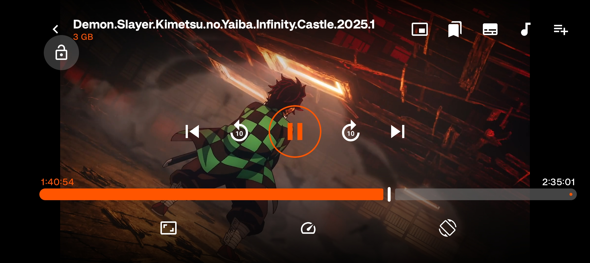</td>
      <td>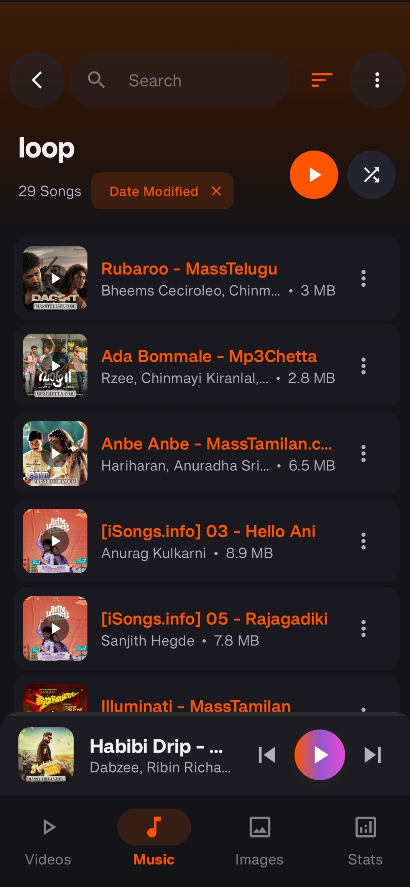</td>
    </tr>
    <tr>
      <td><em>Advanced Gestures & PiP</em></td>
      <td><em>Dynamic Gradient Progress</em></td>
      <td><em>Rich Listening Insights</em></td>
    </tr>
  </table>

  <details>
    <summary><strong>📂 View Full Gallery (8 more screens)</strong></summary>
    <br>
    <table>
      <tr>
        <td align="center">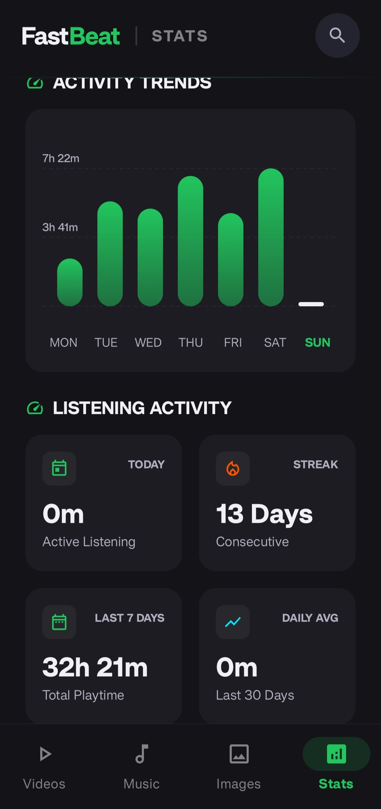<br><sub>Audio Library</sub></td>
        <td align="center">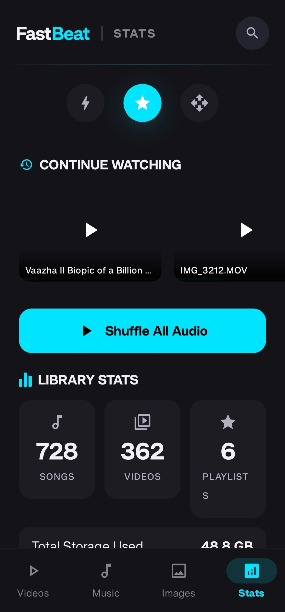<br><sub>Playlists</sub></td>
        <td align="center">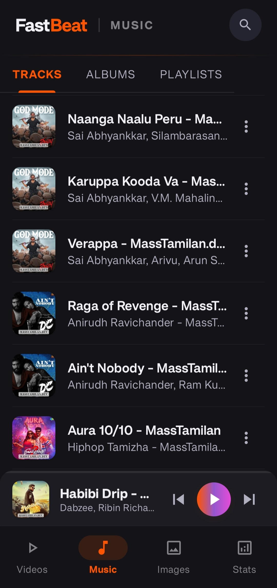<br><sub>Image Gallery</sub></td>
        <td align="center">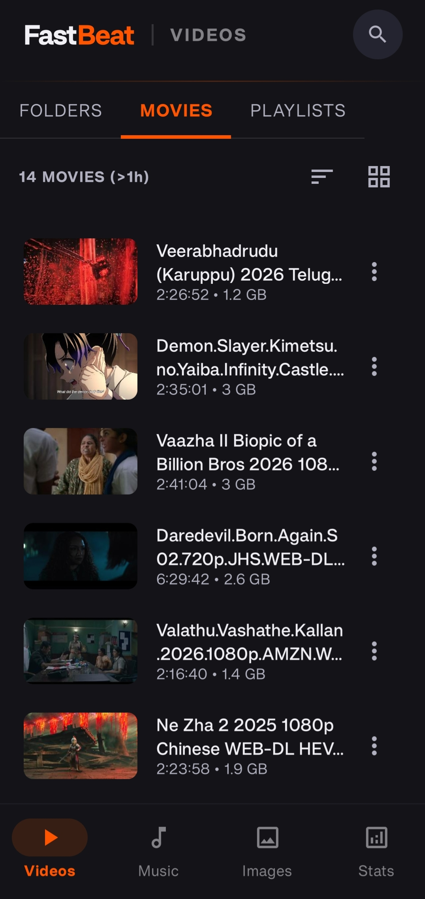<br><sub>Image Viewer</sub></td>
      </tr>
      <tr>
        <td align="center">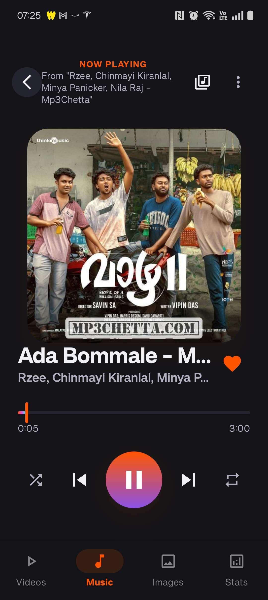<br><sub>PiP Mode</sub></td>
        <td align="center">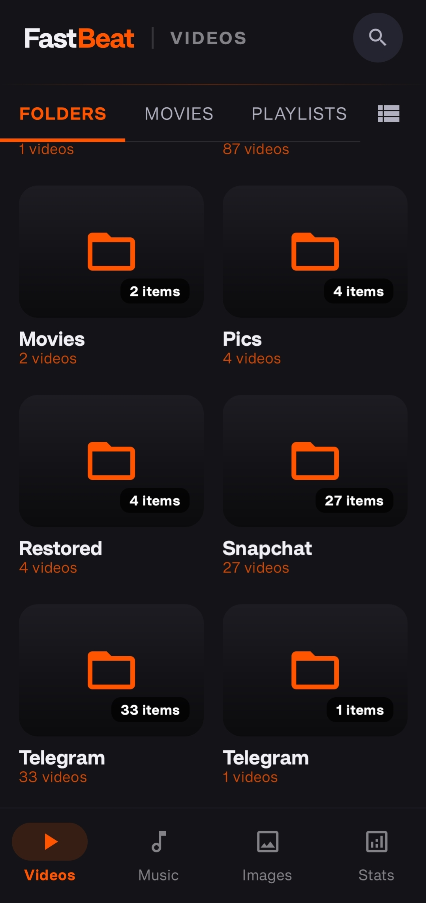<br><sub>Premium Themes</sub></td>
        <td align="center">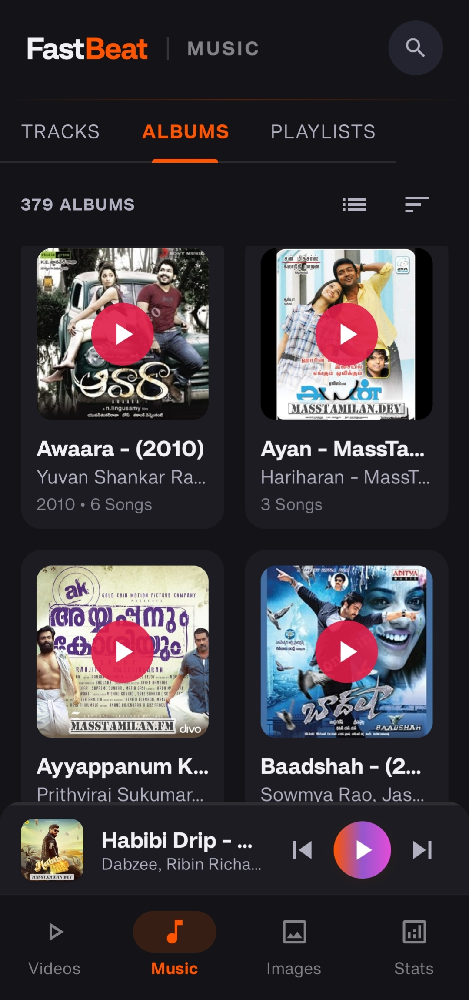<br><sub>App Settings</sub></td>
        <td align="center">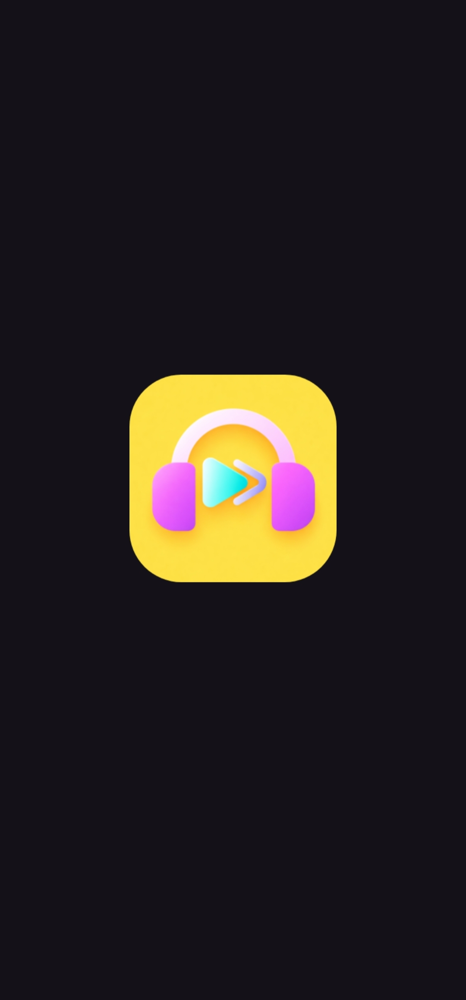<br><sub>Splash Screen</sub></td>
      </tr>
    </table>
  </details>
</div>

---

## 🚀 Quick Start

### Prerequisites

Ensure you have the following installed:

- **Android Studio** (Iguana / Jellyfish or newer)
- **JDK 11+**
- **Android SDK 35** (Target API 35)

### Installation

1. **Clone the repository**
   ```bash
   git clone https://github.com/yourusername/FastBeat.git
   cd FastBeat
   ```

2. **Sync Project**
   Open the project in Android Studio and let Gradle sync.

3. **Install Dependencies**
   The project uses a Version Catalog (`gradle/libs.versions.toml`).
   ```bash
   ./gradlew build
   ```

4. **Run the application**
   Press **Shift + F10** or the Play button in Android Studio with an emulator or physical device (API 26+) connected.

### Build for Production

```bash
# Generate Debug APK
./gradlew assembleDebug

# Generate Release APK
./gradlew assembleRelease
```

---

## 🏗️ Architecture

FastBeat follows the **MVVM (Model-View-ViewModel)** architectural pattern with a clean separation of concerns and a robust **Repository layer**.

```
[ UI Layer (Compose) ]
         |
         v
[ ViewModel (StateFlow) ] <---> [ Media3 Playback Service ]
         |
         v
[ Repository Layer ]
         |
         +-----------------------+
         |                       |
[ Room Database ]       [ MediaStore (Local) ]
```

### Key Design Decisions

| Pattern/Decision | Purpose | Benefit |
|-----------------|---------|---------|
| **Jetpack Compose** | UI Framework | Declarative UI, faster development, and modern animations. |
| **AndroidX Media3** | Media Engine | Unified API for playback and sessions, replacing legacy ExoPlayer. |
| **Dagger Hilt** | Dependency Injection | Compile-time validation and easy management of scoped dependencies. |
| **Room DB** | Local Persistence | Type-safe database access for playlists, history, and stats. |

---

## 📦 Tech Stack

### Core Technologies

| Technology | Version | Purpose |
|------------|---------|---------|
| **Kotlin** | 2.2.10 | Core programming language. |
| **Jetpack Compose** | 1.7.x | Declarative UI framework. |
| **AndroidX Media3** | 1.2.1 | Playback engine and media session management. |
| **Room** | 2.7.0-alpha11 | Local database for offline storage. |
| **Dagger Hilt** | 2.58 | Dependency injection framework. |

### Key Packages

```toml
[libraries]
androidx-media3-exoplayer = "1.2.1"
androidx-room-runtime = "2.7.0-alpha11"
hilt-android = "2.58"
coil-compose = "2.6.0"  # Image Loading
gson = "2.10.1"        # JSON Persistence
```

---

## 📚 Documentation

Comprehensive documentation is available in the `docs/` directory:

| Document | Description |
|----------|-------------|
| [Getting Started](docs/GETTING_STARTED.md) | Detailed installation and developer onboarding. |
| [Features Guide](docs/FEATURES.md) | Deep dive into all available features and roadmap. |
| [Contributing](CONTRIBUTING.md) | Guidelines for contributing to the project. |
| [License](LICENSE) | MIT License details. |

---

## 🛠️ Development

### Project Structure

```text
app/src/main/java/com/local/offlinemediaplayer/
├── data/           # Room DB, ThumbnailManager, DI modules
├── model/          # Domain models (MediaFile, Album, Playlist)
├── repository/     # Data repositories (Playlist, Media)
├── service/        # Background playback service (Media3)
├── ui/             # Compose Screens, Navigation, Themes
└── viewmodel/      # Central StateFlow managers (Playback, Analytics)
```

> **Windows users:** Use `gradlew.bat` instead of `./gradlew` in all commands below.

---

### 🔨 Build Commands

```bash
# Full debug build (compile + resource merge + KSP codegen)
./gradlew assembleDebug

# Full release build (includes R8 minification + resource shrinking)
./gradlew assembleRelease

# Clean build artifacts (useful when switching branches or resolving stale cache)
./gradlew clean

# Clean + full rebuild from scratch
./gradlew clean assembleDebug
```

> The output APK is named **`FastBeat-debug.apk`** / **`FastBeat-release.apk`** (configured via `base { archivesName }` in [`app/build.gradle.kts`](app/build.gradle.kts)), located at `app/build/outputs/apk/debug/` or `app/build/outputs/apk/release/`.

---

### 🧪 Testing

The project has two test source sets with distinct runners:

| Source Set | Location | Runner | Framework | Runs On |
|-----------|----------|--------|-----------|---------|
| **Unit Tests** | `app/src/test/` | JUnit Platform (JUnit 5) | Kotest 5.9.1 + Robolectric 4.14.1 | JVM (no device needed) |
| **Instrumented Tests** | `app/src/androidTest/` | AndroidJUnitRunner (JUnit 4) | Espresso + Compose UI Testing | Device / Emulator |

#### Unit Tests (JVM — fast, no device required)

```bash
# Run all unit tests (all build variants)
./gradlew test

# Run only debug variant unit tests (faster — skips release variant)
./gradlew testDebugUnitTest

# Run a single test class
./gradlew testDebugUnitTest --tests "com.local.offlinemediaplayer.YourTestClass"
```

Key testing libraries available:
- **[Kotest](https://kotest.io/)** — BDD-style specs, matchers (`shouldBe`, `shouldContain`), and property-based testing
- **[MockK](https://mockk.io/)** — Idiomatic Kotlin mocking
- **[Turbine](https://github.com/cashapp/turbine)** — `Flow` / `StateFlow` testing
- **[Robolectric](http://robolectric.org/)** — Android framework on the JVM (runs via JUnit 4 Vintage engine)
- **[Room Testing](https://developer.android.com/training/data-storage/room/testing-db)** — In-memory database for DAO tests

> **Note:** Unit tests use `useJUnitPlatform()` so Kotest specs run natively. Robolectric-based tests run through the JUnit Vintage engine on the same platform.

#### Instrumented Tests (require a connected device or emulator)

```bash
# Run all instrumented tests
./gradlew connectedAndroidTest

# Run on a specific device (by serial)
./gradlew connectedAndroidTest -Pandroid.serial=<DEVICE_SERIAL>
```

> Room migration schemas are auto-exported to `app/schemas/` and packaged into the androidTest APK's assets, enabling `MigrationTestHelper` to work out of the box.

---

### 🔍 Static Analysis & Linting

The project enforces code quality through **three complementary tools**, each with baseline files so only **new** violations block your build:

#### 1. Android Lint

```bash
# Run Android Lint checks
./gradlew lint
```

Produces HTML/XML reports at `app/build/reports/lint-results-debug.html`.

#### 2. Detekt (Kotlin static analysis)

[Detekt](https://detekt.dev/) catches code smells, complexity issues, and naming violations.

```bash
# Run detekt analysis
./gradlew detekt
```

| Config File | Purpose |
|------------|---------|
| [`detekt.yml`](detekt.yml) | Rule overrides (e.g., `LongMethod` threshold = 120 for Composables) |
| [`detekt-baseline.xml`](detekt-baseline.xml) | Baseline of pre-existing violations — only **new** issues fail the build |

Reports are generated at `app/build/reports/detekt/` (HTML + XML).

```bash
# Regenerate baseline (ONLY after consciously accepting new technical debt)
./gradlew detektBaseline
```

> ⚠️ **Do not regenerate the baseline to silence new violations.** The baseline exists so pre-existing debt is tracked while every new file is held to the full rule set.

#### 3. ktlint (Kotlin formatting)

[ktlint](https://pinterest.github.io/ktlint/) enforces consistent code formatting based on the [`.editorconfig`](.editorconfig) rules.

```bash
# Check formatting (CI-safe — never modifies files)
./gradlew ktlintCheck

# Auto-fix formatting issues locally
./gradlew ktlintFormat
```

| Config File | Purpose |
|------------|---------|
| [`.editorconfig`](.editorconfig) | Formatting rules (indent = 4 spaces, max line = 120, Composable PascalCase exception) |
| [`app/config/ktlint/baseline.xml`](app/config/ktlint/baseline.xml) | Baseline of pre-existing formatting violations |

> **Important:** Always run `ktlintCheck` (not `ktlintFormat`) to validate — CI will never auto-fix your code, so you need to know what CI sees.

---

### ✅ Pre-Push Checklist

Before pushing to the remote repository, run the **full quality gate** locally. This mirrors exactly what the [CI pipeline](.github/workflows/build.yml) runs:

```bash
# 1. Compile + Android Lint + Unit tests (debug variant only — no R8 overhead)
./gradlew assembleDebug lint testDebugUnitTest --stacktrace

# 2. Static analysis (detekt)
./gradlew detekt --stacktrace

# 3. Formatting check (ktlint)
./gradlew ktlintCheck --stacktrace
```

Or run everything in a single command:

```bash
./gradlew assembleDebug lint testDebugUnitTest detekt ktlintCheck --stacktrace
```

#### What CI Runs (for reference)

The [`build.yml`](.github/workflows/build.yml) GitHub Actions workflow runs on every push and PR to `master`:

| Step | Gradle Task(s) | Fails On |
|------|----------------|----------|
| **Build + Lint + Test** | `assembleDebug lint testDebugUnitTest` | Compile errors, lint errors, test failures |
| **Static Analysis** | `detekt` | New detekt violations (beyond baseline) |
| **Formatting** | `ktlintCheck` | New formatting violations (beyond baseline) |
| **Security Scan** | CodeQL (separate workflow) | Security vulnerabilities (weekly + on PR) |

> The CI also uploads the **debug APK** and **lint/test reports** as downloadable artifacts.

---

### 🧰 Useful Gradle Tasks Reference

| Command | Description |
|---------|-------------|
| `./gradlew assembleDebug` | Build debug APK |
| `./gradlew assembleRelease` | Build release APK (R8 + resource shrinking) |
| `./gradlew test` | Run all unit tests (all variants) |
| `./gradlew testDebugUnitTest` | Run unit tests (debug variant only — faster) |
| `./gradlew connectedAndroidTest` | Run instrumented tests on device/emulator |
| `./gradlew lint` | Android Lint analysis |
| `./gradlew detekt` | Detekt static analysis |
| `./gradlew detektBaseline` | Regenerate detekt baseline (use sparingly) |
| `./gradlew ktlintCheck` | Check formatting compliance |
| `./gradlew ktlintFormat` | Auto-fix formatting issues |
| `./gradlew clean` | Delete all build outputs |
| `./gradlew dependencies` | Print full dependency tree |
| `./gradlew :app:dependencies --configuration debugRuntimeClasspath` | Debug runtime dependency tree |
| `./gradlew tasks` | List all available Gradle tasks |

---

## 🔮 Roadmap

### Coming Soon
- [ ] **Equalizer** — Advanced 10-band equalizer with presets (Q2 2026).
- [ ] **Lyrics Support** — Local .lrc file parsing and synchronized display (Q3 2026).
- [ ] **Chromecast Support** — Cast your local media to large screens (Q4 2026).

### Under Consideration
- [ ] DLNA/UPnP streaming from local servers.
- [ ] Custom sound profiles per device.
- [ ] AI-powered smart playlists based on mood.

---

## 🤝 Contributing

Contributions are welcome! Please follow these steps:

1. **Fork** the repository.
2. **Create** a feature branch (`git checkout -b feature/amazing-feature`).
3. **Commit** your changes (`git commit -m 'feat: add amazing feature'`).
4. **Push** to the branch (`git push origin feature/amazing-feature`).
5. **Open** a Pull Request.

See [CONTRIBUTING.md](CONTRIBUTING.md) for detailed guidelines.

---

## 📄 License

This project is licensed under the MIT License - see the [LICENSE](LICENSE) file for details.

---

## 🙏 Acknowledgments

- [AndroidX Media3 Team](https://developer.android.com/guide/topics/media/media3) for the robust playback engine.
- [Material Design 3](https://m3.material.io/) for the beautiful UI components.
- [Coil](https://coil-kt.github.io/coil/) for the efficient image loading library.

---

<div align="center">

**Made with ❤️ using Jetpack Compose**

[Report Bug](https://github.com/yourusername/FastBeat/issues) • [Request Feature](https://github.com/yourusername/FastBeat/issues)

</div>
