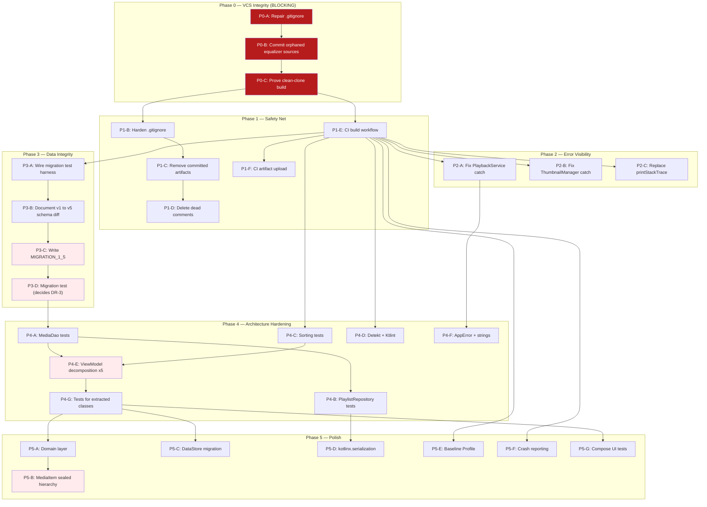

# FastBeat Remediation — Implementation Plan

> **Revision:** 2 (2026-08-21) — supersedes Revision 1
> **Sources:** [ENGINEERING_AUDIT.md](./docs/ENGINEERING_AUDIT.md) + [AUDIT_ADDENDUM.md](./docs/AUDIT_ADDENDUM.md)
> **Tier:** **Consequential** — shipped consumer product, persisted user data, background service, Play Store presence.
> **Guiding principle:** *Zero regressions. Every change independently verifiable and independently revertible.*
> **Execution protocol:** **One task per session.** The implementor completes exactly one task ID, updates its
> status row in [§9 Progress Tracker](#9-progress-tracker), and stops. The next task is chosen by the operator.

---

## 0. How to use this document

1. Open [§9 Progress Tracker](#9-progress-tracker). Find the first row with status ⬜ whose dependencies are all ✅.
2. Read that task's full card in §6–§8. Read its **Blast radius** and **Watch-outs** before writing code.
3. Implement, run the **Verify** command, paste real output.
4. Mark the row ✅ (or 🚧 / ⛔ with a note), then stop.

**Status legend**

| Symbol | Meaning |
|---|---|
| ⬜ | Not started |
| 🚧 | In progress (partially landed — note what remains) |
| ✅ | Complete and verified with command output |
| ⛔ | Blocked (record the blocker and its owner) |
| ⏭️ | Deliberately deferred (record the reason; not a failure) |

**Risk legend**

| Risk | Meaning | Gate required |
|------|---------|---------------|
| ⬜ None | Touches no runtime code (docs, gitignore, CI config) | Self-review |
| 🟩 Low | Additive-only; no existing behavior modified | Build passes |
| 🟨 Medium | Modifies existing code; behavior should be identical | Build + tests + manual smoke |
| 🟥 High | Changes data flow, architecture, or persistence | Build + tests + targeted manual QA plan |

---

## 1. What changed in Revision 2

Revision 1 was a sound plan built on an incomplete picture: it audited the **source files** but not the
**repository state**. A verification pass ([Addendum A](./docs/AUDIT_ADDENDUM.md)) re-ran every claim
against the working tree. Five things changed as a result.

| # | Change | Why |
|---|---|---|
| 1 | **New Phase 0 inserted ahead of everything** | `.gitignore` line 7 (`/app`) excludes the whole app module. Two equalizer source files are unversioned and the committed tree does not compile. Nothing else can safely proceed. |
| 2 | **CI demoted from first task to second phase** | CI cannot go green while `HEAD` references missing files. Adding CI first produces a red build with a misleading cause. |
| 3 | **Migration work gained a prerequisite task** | `room-testing` is only on the `src/test` classpath and the schema directory is on no test classpath. The Rev-1 migration test could not have run where it was placed. |
| 4 | **Migration approach became evidence-driven** | The three new `playback_history` columns are `NOT NULL` with no SQL default; SQLite requires one on `ADD COLUMN`. Whether Room accepts the mismatch is decided by the test, not by assumption. See [DR-3](#dr-3--migration-shape-for-playback_history). |
| 5 | **Added a File Contention Map** | `PlaybackViewModel.kt` is touched by 11 tasks. Ordering rules now prevent two tasks from colliding in the same file. See [§5](#5-file-contention-map). |

### Task ID remap (Rev 1 → Rev 2)

| Rev 1 | Rev 2 | Note |
|---|---|---|
| P0-A.1 | P1-B | `.gitignore` — split; the *dangerous* half is now P0-A |
| P0-A.2 | P1-C | artifact removal |
| P0-A.3 | P1-D | commented-out code |
| P0-B.1 / P0-B.2 | P1-E / P1-F | CI |
| P1-A.1 / P1-A.2 | P2-A / P2-B | swallowed exceptions |
| P1-B.1 | P2-C | printStackTrace |
| P1-C.1 | P3-B | schema diff (now preceded by new P3-A) |
| P1-C.2 | P3-C | write migration |
| P1-C.3 | ⏭️ dropped | see [DR-5](#dr-5--drop-the-schema-export-smoke-test) |
| P1-D.1 | P3-D | migration test |
| P2-A.1 … P3-G.2 | P4-* / P5-* | see §7, §8 |
| — | **P0-A, P0-B, P0-C, P3-A** | new in Rev 2 |

---

## 2. Verified baseline

Every fact below was confirmed by command on 2026-08-21. Do not re-derive; do re-check if you suspect drift.

| Property | Value |
|---|---|
| Branch | `feature/rework` (local-only, no upstream) branched from `master` = `origin/master` = `a7f3b42` |
| ⚠️ master state | ✅ **RESOLVED 2026-08-23 — PR #12 merged.** `origin/master` now contains `audio/` and `playback/` (11 files), the CI workflow, detekt + ktlint config and baselines, `MIGRATION_1_5`, `DatabaseModuleTest`, `tools/verify_migration_sql.py` and 18 test classes; `gradlew` is mode `100755`. Verified green at that commit: `assembleDebug lint testDebugUnitTest detekt ktlintCheck` → **177 tests / 0 failures**. *Historical record of the original defect:* **`origin/master` did not compile.** PR #10 merged the equalizer *references* without the *implementation*; `app/…/audio/` does not exist on master. `.gitignore` blob `112c157` still contains `/app`. |
| Toolchain | AGP 9.0.0, Kotlin 2.2.10, KSP 2.2.10-2.0.2, Gradle 9.1.0, Room 2.7.2, Hilt 2.60.1 |
| SDK | `compileSdk` 36, `targetSdk` 35, `minSdk` 26 |
| JVM | source/target 11; **Gradle itself needs JDK 17+** (AGP 9) |
| DB | `AppDatabase` version **5**, 8 entities, `exportSchema = true` |
| Schemas on disk | `1.json`, `5.json` only (v1 = 2 tables, v5 = 8 tables) |
| Migration policy | `.fallbackToDestructiveMigrationFrom(dropAllTables = true, 1, 2, 3, 4)` |
| Hilt modules | exactly one — `DatabaseModule` |
| Tests | 7 real (adaptive layout) + 1 placeholder unit; 1 placeholder androidTest |
| Unit test runner | `useJUnitPlatform()` + Kotest 5.9.1 + Robolectric 4.14.1 |
| CI | `codeql.yml`, `codewiki_sync.yml` — **no build/test workflow** |
| Largest file | `PlaybackViewModel.kt` — 2,296 lines |
| Untracked sources | `audio/AudioEffectsManager.kt` (306 lines), `ui/components/EqualizerSheet.kt` |

---

## 3. Essentialism triage

Applying the Abstraction Decision Procedure and Essentialism Triage from `engineering-standards`.

### Must be right, now — irreversible or actively losing value
- **P0** — unversioned source. Every hour this stands is an hour of exposure to permanent loss.
- **P3** — destructive migrations. Every user upgrade from v1–v4 silently destroys their data.
- **P2** — swallowed exceptions. Cheap, and they hide the failures the other work needs to see.

### Should be right by ship
- **P1** — CI. Without it, every later phase is unverified by anything but local memory.
- **P4-A…D** — DAO, migration, and pure-logic tests. These are the safety net that makes P4-E (decomposition) survivable.
- **P4-E** — `PlaybackViewModel` decomposition. The single largest maintainability lever.

### Defer with a seam
- **P5-C DataStore** — SharedPreferences works today. The seam is `SortPreferencesManager`; keep new prefs reads funnelled through a manager class so the swap stays local. Elevated in priority by the `app_prefs` key-collision finding (Addendum §A.4).
- **P5-B `MediaItem` sealed hierarchy** — correct destination, but it touches nearly every file. It needs P4's test coverage to be affordable. Seam: keep `MediaFile` construction centralized in `MediaRepository`.
- **P5-D kotlinx.serialization** — Gson has exactly one consumer with two call sites. Cheap later; no compounding cost now.

### Explicitly not doing
- **Migrations for schema v2, v3, v4.** Those schemas were never exported and cannot be reconstructed with confidence. See [DR-4](#dr-4--do-not-write-unverifiable-migrations-for-v2v4).
- **Rewriting the mega-composables** (`MeScreen`, `VideoPlayerScreen`, …). Real debt, but it is *inert* debt — it slows changes, it does not lose data or crash. It stays on the backlog until Phases 0–4 are done.
- **A multi-module split.** No evidence of a build-time or team-scale problem that would justify it.
- **`AudioPlaybackManager` / `VideoPlaybackManager`** as named in the audit. The decomposition in P4-E cuts along *ownership of state* instead, which produced better-defined seams. Recorded so nobody "restores" the audit's version.

---

## 4. Decision records

### DR-1 — Repair `.gitignore` rather than rewrite it
**Decision:** Replace the two harmful lines (`/app`, `*.txt`) with precise rules; leave everything else alone.
**Context:** `/app` was almost certainly meant as `/app/build`. `*.txt` was likely meant to catch the committed
build logs, but it also swallows `baseline-prof.txt` and any future `.txt`.
**Alternatives:** *Replace with a stock Android `.gitignore`* — rejected: a wholesale swap changes many rules at once,
so if something breaks, the cause is ambiguous. A two-line fix has a two-line blame.
**Consequences:** Reversible in one commit. After the fix, previously ignored files become visible to `git status` —
that is the point, but it means the next `git add` needs care (see P0-B watch-outs).

### DR-2 — Commit the equalizer sources as-is; do not review-and-refactor them in the same task
**Decision:** P0-B commits `AudioEffectsManager.kt` and `EqualizerSheet.kt` unchanged.
**Context:** They are the only copy in existence. Preservation and improvement are different jobs with different risk.
**Alternatives:** *Clean them up while committing* — rejected: mixes an irreversible-if-botched rescue with discretionary
edits, and makes the diff unreviewable.
**Consequences:** Any quality issues in those two files are logged as follow-ups, not fixed in P0-B.

### DR-3 — Migration shape for `playback_history`  ✅ **RESOLVED 2026-08-22 by P3-D — simple `ADD COLUMN` accepted**
**Decision:** Attempt the simple `ALTER TABLE … ADD COLUMN … NOT NULL DEFAULT <n>` first. Let
`runMigrationsAndValidate()` decide whether it is acceptable. Keep the table-rebuild pattern documented as a
ready fallback.
**Context:** The three added columns are `NOT NULL` with no declared SQL default (entity uses Kotlin defaults).
SQLite *requires* a `DEFAULT` when adding a `NOT NULL` column to a populated table, so the migrated column will
carry a default the exported v5 schema does not declare. Room 2.7.2's `TableInfo.Column` comparison may or may
not reject that.
**Alternatives:**
- *Bump entity to `@ColumnInfo(defaultValue = …)` and go to schema v6* — rejected as the default: changing a
  column default in SQLite requires a full table rebuild, which would force **already-healthy v5 users** through a
  destructive-shaped operation. That doubles the blast radius to fix a problem v5 users do not have.
- *Rebuild the table unconditionally (create-copy-drop-rename)* — held in reserve. Guarantees a byte-exact match
  with the exported schema, but is more code and more risk than may be necessary.
**Consequences:** The test is written **before** the decision is locked. If validation passes, we keep the simple
form. If it fails, we switch to the rebuild — the test already exists to prove it. Either way the answer is
evidence, not a guess. **Record the observed outcome in P3-D's status note** so the next reader does not re-litigate it.

**Evidence gathered in P3-B (2026-08-22) — necessary, not yet sufficient:**
1. Confirmed from the schema files: all three columns are `INTEGER NOT NULL` with `defaultValue` **absent** in
   `5.json`. The premise of this DR is factual, not assumed.
2. The `ALTER TABLE … NOT NULL DEFAULT <n>` form **executes correctly on real SQLite 3.50.4** against a populated
   v1 table: the pre-existing row is preserved unchanged and the new columns take `0 / -1 / -1`. The resulting
   structure has **zero diff** against v5 (column names, affinities, NOT NULL flags, indices, FK enforcement).
3. Reading Room's `TableInfo.Column` equality, `defaultValue` is compared **only when the entity side declares
   one**. Here it declares none, so the DB-side default should be ignored during validation.

⚠️ **This is not the decision.** Points 1–2 prove the SQL is correct; point 3 is *reasoning about* Room's
validator, not an observation of it. Only `runMigrationsAndValidate()` on a device exercises the real comparison —
**P3-D still decides DR-3.** The value of this evidence is that if P3-D fails, we already know the SQL itself is
sound and the fault lies in Room's validation, which points straight at the table-rebuild fallback.

### DR-4 — Do not write unverifiable migrations for v2–v4
**Decision:** Ship a verified `MIGRATION_1_5`. Leave 2, 3, 4 on the destructive fallback.
**Context:** Schemas 2–4 were never exported. A defensive "works from any version" migration
(`CREATE TABLE IF NOT EXISTS` + pragma-guarded `ADD COLUMN`) is writable but not verifiable.
**Alternatives:** *Write the defensive migration anyway* — rejected, and the reasoning matters: if it produces a
schema Room does not recognize at runtime, Room throws on open. That is a **crash loop on upgrade** — strictly
worse for the user than the current data wipe, which at least leaves a working app. Preferring a silent wipe over
a possible crash loop is the correct trade only because we cannot test the alternative.
**Consequences:** v2–v4 users still lose data. This is honest, bounded, and documented. **Revisit if
[OQ-2](#open-questions) reveals real users on those versions.**

### DR-5 — Drop the schema-export smoke test
**Decision:** Rev 1's P1-C.3 (bump to v6, confirm `6.json` appears, revert) is removed.
**Context:** It tested Gradle rather than FastBeat, and P3-D's migration test reads `1.json` from the schema
directory — so if export is broken, P3-D fails loudly and for a better reason.
**Consequences:** One less task; the risk it covered is covered better elsewhere.

---

## 5. File contention map

`PlaybackViewModel.kt` is touched by 11 tasks. Two tasks editing it concurrently will conflict badly, and a
merge resolution in a 2,296-line file is exactly where silent regressions enter. **Rule: tasks that share a
🔥 hot file are strictly serialized — never run them in parallel branches.**

| File | Tasks that touch it | Serialization rule |
|---|---|---|
| 🔥 `viewmodel/PlaybackViewModel.kt` | P1-D, P2-C, P4-E.1–E.5, P4-F, P5-A.2, P5-C.3 | Strictly sequential. P4-E.1 must land before E.2–E.5 start. |
| 🔥 `app/build.gradle.kts` | P3-A, P4-D.1, P5-C.1, P5-D, P5-E, P5-F | One at a time; each is a small isolated diff. |
| 🔥 `.github/workflows/build.yml` | P1-E, P1-F, P4-D.1, P5-E | Additive steps only; append, never restructure. |
| `data/di/DatabaseModule.kt` | P3-C | Sole owner. |
| `service/PlaybackService.kt` | P2-A | Sole owner. |
| `ui/screens/VideoPlayerScreen.kt` | P2-C, P4-G | Sequential. |
| `.gitignore` | P0-A, P1-B | P0-A first, always. |
| `res/values/strings.xml` | P4-F, P5-* | Additive only; never renumber existing keys. |

**Branching model:** one feature branch per phase (`fix/phase-0-vcs-integrity`, `fix/phase-1-safety-net`, …).
Each task ID is one squash-mergeable commit. Never mix a formatting commit with a logic commit (see P4-C.2).

---

## 6. Dependency graph



**Critical path:** `P0-A → P0-B → P0-C → P1-E → P3-A → P3-B → P3-C → P3-D → P4-A → P4-E.1 → P4-E.2…E.5 → P4-G`.
Everything else can slot into gaps. P4-C, P4-D, P5-E, P5-F need only CI and are good filler when the critical
path is blocked on a question.

---

## 7. Phase 0 — Version Control Integrity 🔴 BLOCKING

> **Goal:** Make the repository an honest record of the project. Until this is done, work performed can be lost.
> **Branch:** `feature/rework` (already created, local-only) — supersedes the planned `fix/phase-0-vcs-integrity`.
> **Estimated:** 45–60 minutes total.

> [!CAUTION]
> **Escalated 2026-08-21.** This phase was written when the breakage was confined to a feature branch.
> PR #10 has since merged that branch into `master`, carrying the equalizer *references* without the
> *implementation*. **`origin/master` no longer compiles**, and the two source files still exist only
> on one developer's disk — they were never in the PR, because `.gitignore` excluded them from
> `git add`. Phase 0 is now a **production-branch repair**, not a pre-emptive cleanup, and its output
> must reach `master`. Nothing in Phases 1–5 should start until it does.

### P0-A — Repair the two harmful `.gitignore` rules

| | |
|---|---|
| **Status** | ✅ Committed in `85749fb` |
| **Risk** | 🟨 Medium — no runtime code changes, but it changes what git sees, which is how the damage happened |
| **Blast radius** | Repository-wide visibility. No effect on the built app. |
| **Depends on** | Nothing |
| **Files** | `.gitignore` (lines 7 and 18) |

**Steps**
1. Replace line 7 `/app` with `/app/build`.
2. Replace line 18 `*.txt` with explicit entries: `build_info_output.txt`, `build_stacktrace.txt`.
3. Change nothing else in the file. `app/release` and `app/release/baselineProfiles` on lines 8 and 19 stay.

**Verify**
```bash
git check-ignore -v app/src/main/java/com/local/offlinemediaplayer/audio/AudioEffectsManager.kt || echo "OK: no longer ignored"
git check-ignore -v baseline-prof.txt || echo "OK: no longer ignored"
git check-ignore -v app/build/outputs/x.apk && echo "OK: build output still ignored"
git status --short
```
Expect: the first two print `OK`, the third confirms `app/build` is still ignored, and `git status` now lists the
two equalizer files as untracked.

**Watch-outs**
- Do **not** `git add -A` after this task. Newly visible files include IDE state and build output. P0-B adds files by explicit path.
- `local.properties` is ignored twice (lines 3 and 17) — harmless duplication. Leave it; unrelated to this fix.

**Rollback** `git revert` — single-file, two-line change.

---

### P0-B — Commit the orphaned equalizer sources

| | |
|---|---|
| **Status** | ⬜ |
| **Risk** | 🟩 Low — adds files that the already-committed code expects to exist |
| **Blast radius** | Makes `HEAD` compile. Strictly an improvement over the current state. |
| **Depends on** | P0-A |
| **Files** | `app/src/main/java/com/local/offlinemediaplayer/audio/AudioEffectsManager.kt`, `app/src/main/java/com/local/offlinemediaplayer/ui/components/EqualizerSheet.kt` |

**Steps**
1. Read both files end to end before committing them — you are publishing code that has never been reviewed.
2. Add **by explicit path only**:
   ```bash
   git add app/src/main/java/com/local/offlinemediaplayer/audio/AudioEffectsManager.kt \
           app/src/main/java/com/local/offlinemediaplayer/ui/components/EqualizerSheet.kt
   ```
3. Confirm nothing else is staged: `git status --short`.
4. Commit: `fix: track equalizer sources excluded by the /app gitignore rule`.
5. Per [DR-2](#dr-2--commit-the-equalizer-sources-as-is-do-not-review-and-refactor-them-in-the-same-task), make **no edits** to either file. Log any quality concerns as follow-up items in §9.

**Verify**
```bash
git grep -n "AudioEffectsManager\|EqualizerSheet" HEAD -- app/src | wc -l   # references exist
git ls-files app/src/main/java/com/local/offlinemediaplayer/audio/AudioEffectsManager.kt  # now tracked
git ls-files app/src/main/java/com/local/offlinemediaplayer/ui/components/EqualizerSheet.kt
```
Every referenced symbol must now resolve to a tracked file.

**Watch-outs**
- Scan both files for anything that must not be committed (absolute local paths, device IDs, credentials) before staging.
- `AudioEffectsManager` uses `getSharedPreferences(PREFS, …)` — note its prefs file name in §9 follow-ups; P5-C needs it.

**Rollback** `git revert`. Do **not** `git rm` — that would delete the only copy.

---

### P0-C — Prove the committed tree builds from a clean checkout

| | |
|---|---|
| **Status** | ✅ BUILD SUCCESSFUL (4m 22s) from clean clone of `feature/rework` |
| **Risk** | ⬜ None — read-only verification |
| **Blast radius** | None. |
| **Depends on** | P0-B |
| **Files** | None |

**Steps**
1. Create a scratch clone of the *committed* state — not the working tree, which has the files on disk regardless:
   ```bash
   git clone --branch feature/rework --single-branch . /tmp/fastbeat-cleancheck
   ```
2. Copy `local.properties` (it is correctly gitignored and holds the SDK path) into the clone.
3. Run `./gradlew assembleDebug` inside the clone.
4. Delete the scratch clone.

**Verify** `BUILD SUCCESSFUL`. Paste the tail of the output into the status note.

**Why this task exists separately:** the whole point of Phase 0 is that the working tree lies about what is
committed. Building the working tree proves nothing. This is the only task that actually closes the finding, and
it is the gate for Phase 1.

**Watch-outs**
- If the build fails on a *different* missing file, Phase 0 is not done — extend P0-B, do not proceed.
- First run downloads the Gradle 9.1.0 distribution and the AGP 9 dependency graph; allow time and network.
- Needs JDK 17+ on `PATH` (AGP 9 requirement) even though the project's bytecode target is 11.

---

## 8. Phases 1–5

### Phase 1 — Safety Net

> **Goal:** Guardrails before touching logic. **Branch:** `fix/phase-1-safety-net`. **Pre-condition:** P0-C green.

#### P1-B — Harden `.gitignore` against recurrence
| | |
|---|---|
| **Status** | ✅ Rewritten with a documented header; ignore-set diff shows **+2 intended, −0 lost** · **Risk** ⬜ None · **Depends on** P0-C |
| **Files** | `.gitignore` |
| **Task** | Add `*.tmp`, `output.md`, `/.idea/` refinement. Add a comment above the `/app/build` line recording *why* it is not `/app` — this is the fence that was previously knocked down. |
| **Verify** | `git check-ignore -v app/build.gradle.kts.tmp` matches; `git check-ignore app/src/main/…/MainActivity.kt` does **not** match. |

#### P1-C — Remove committed build artifacts
| | |
|---|---|
| **Status** | ✅ All 5 untracked and deleted; `git ls-files -i -c` now returns empty · **Risk** ⬜ None · **Depends on** P1-B |
| **Files** | `build_info_output.txt` (49 KB), `build_stacktrace.txt`, `app/build.gradle.kts.tmp`, `output.md`, `app/release/output-metadata.json` ← **added by P1-B**, see F-9 |
| **Task** | `git rm --cached` then delete from disk. Commit: `chore: remove committed build artifacts`. |
| **Verify** | `git ls-files -i -c --exclude-standard` returns **empty** — this is the strongest form: it lists every file that is tracked *despite* matching an ignore rule, so it cannot miss one the way a hand-written `grep` can. |
| **Watch-out** | These are tracked *despite* matching ignore rules — ignore rules never apply to already-tracked files. `--cached` first, then delete, or git will not stage the removal cleanly. |

#### P1-D — Delete commented-out code and stale comments
| | |
|---|---|
| **Status** | ✅ 42 lines deleted across 10 files, **0 inserted**; `assembleDebug` green · **Risk** 🟩 Low · **Depends on** P1-C |
| **Files** | ⚠️ **Card underscoped this.** A repo-wide scan found the defect class in **8** files, not 1: `MainScreen.kt` (3), `VideoListScreen.kt` (13), `AudioListScreen.kt` (5), `NowPlayingScreen.kt` (4), `AlbumListScreen.kt` (3), `VideoFolderScreen.kt` (3), `AlbumDetailScreen.kt` (1), `AudioLibraryScreen.kt` (1). Plus `PlaybackViewModel.kt` (3 archaeology comments) and `AndroidManifest.xml` (3). Scope widened — see F-11. |
| **Task** | Remove commented-out imports, the three "Removed duplicate…" archaeology comments, and the commented-out `android:label`/`icon`/`roundIcon` manifest attributes. |
| **Verify** | `./gradlew assembleDebug` succeeds. |
| **Watch-out** | 🔥 Touches `PlaybackViewModel.kt`. Do it now, while the file is otherwise untouched — after P4-E starts, this becomes a merge hazard for zero benefit. |

#### P1-E — Add the CI build workflow
| | |
|---|---|
| **Status** | ✅ Authored; the exact CI command was run locally first and is green · ⏳ **Green-run verification pending push** · **Risk** ⬜ None · **Depends on** P0-C |
| **Files** | `.github/workflows/build.yml` [NEW], `gradlew` (file mode only — see F-12) |
| **Task** | Trigger on `push` + `pull_request` to `master` **and** `feature/**`, `fix/**`, `refactor/**`. `ubuntu-latest`, `actions/setup-java@v4` with **JDK 17** (`temurin`), `gradle/actions/setup-gradle@v4` for caching. Run `./gradlew assembleDebug lint testDebugUnitTest`. |
| **Verify** | Push the branch; the Actions tab shows a green run. |
| **Watch-outs** | • The default branch is `master`, not `main` — Rev 1 said `main`. • Use `testDebugUnitTest`, not `test`: bare `test` also builds the release variant and will trip over R8/minification for no gain at this stage. • `useJUnitPlatform()` is already configured, so Kotest specs run without extra CI setup. |

#### P1-F — Upload the debug APK as a CI artifact
| | |
|---|---|
| **Status** | ✅ Two upload steps added; paths verified against real build output · ⏳ **PR-summary verification pending push** · **Risk** ⬜ None · **Depends on** P1-E |
| **Files** | `.github/workflows/build.yml` |
| **Task** | Append an `actions/upload-artifact@v4` step for `app/build/outputs/apk/debug/FastBeat-debug.apk`. |
| **Verify** | A PR run shows the artifact in its summary. |
| **Watch-out** | The APK is named `FastBeat-debug.apk`, not `app-debug.apk` — `base { archivesName = "FastBeat" }` in `app/build.gradle.kts` renames it. A stock path glob will silently match nothing. |

---

### Phase 2 — Error Visibility

> **Goal:** Make failures observable before changing anything that could cause them.
> **Branch:** `fix/phase-2-error-visibility`. **Pre-condition:** P1-E green.

#### P2-A — Fix the swallowed exception in `PlaybackService.onTaskRemoved()`
| | |
|---|---|
| **Status** | ✅ Logged, not retried; `assembleDebug` green · **Risk** 🟩 Low · **Depends on** P1-E |
| **Files** | `service/PlaybackService.kt:107` |
| **Task** | Replace `catch (_: Exception) {}` with `catch (e: Exception) { Log.e(TAG, "Failed to persist playback position on task removal", e) }`. Add a `TAG` companion constant if absent. |
| **Verify** | `grep -rn "catch (_" app/src/main/java/com/local/offlinemediaplayer/service/` returns empty; `./gradlew assembleDebug` succeeds. |
| **Watch-out** | This sits inside a `runBlocking` in `onTaskRemoved` — a lifecycle callback with a short deadline. Log only; do **not** add retry logic or anything that extends the block. |

#### P2-B — Fix the swallowed exception in `ThumbnailManager`
| | |
|---|---|
| **Status** | ✅ `Log.w` with the throwable; `assembleDebug` green · **Risk** 🟩 Low · **Depends on** P1-E |
| **Files** | `data/ThumbnailManager.kt:128` |
| **Task** | Replace with `Log.w(TAG, "Failed to release MediaMetadataRetriever", e)` — warning, not error: the retriever is already being released and the leak is bounded. |
| **Verify** | `grep -rn "catch (_" app/src/main/` returns empty (both sites now fixed). |

#### P2-C — Replace all `e.printStackTrace()` with `Log.e`
| | |
|---|---|
| **Status** | ✅ All 3 sites; `TAG` at file scope in the composable file; `assembleDebug` green · **Risk** 🟩 Low · **Depends on** P1-E |
| **Files** | `MainActivity.kt:114`, `ui/screens/VideoPlayerScreen.kt:228`, `ui/screens/VideoPlayerScreen.kt:476` |
| **Task** | Add a `TAG` constant per file where missing; replace each call with `Log.e(TAG, "<what was being attempted>", e)`. Write a real context string per site — "error" is not a context. |
| **Verify** | `grep -rn "printStackTrace" app/src/` returns empty. |
| **Watch-out** | The two `VideoPlayerScreen` sites are inside composables. `TAG` belongs at file scope (`private const val TAG = "VideoPlayerScreen"`), not inside the composable body where it would be reallocated per recomposition. |

---

### Phase 3 — Data Integrity 🟥

> **Goal:** Stop destroying user data on upgrade. **Branch:** `fix/phase-3-data-integrity`. **Pre-condition:** P1-E green.

> [!CAUTION]
> Highest-risk work in the plan. A broken migration is data loss for real users, and it ships silently.
> The approach is **additive-only** — never drop or rename a column that current code reads.
> Read [DR-3](#dr-3--migration-shape-for-playback_history) and [DR-4](#dr-4--do-not-write-unverifiable-migrations-for-v2v4) first.

#### P3-A — Wire the migration test harness *(new in Rev 2)*
| | |
|---|---|
| **Status** | ✅ Wired **and** unblocked — the source set turned out to be unbuildable for an unrelated reason, see F-14 · **Risk** 🟩 Low — build config only, 38 insertions / 0 deletions · **Depends on** P1-E |
| **Files** | `app/build.gradle.kts` |

> **This task justified its own existence.** It was separated from P3-D so that "a build-config failure
> never gets mistaken for a migration failure" — and that is exactly what happened. `androidTest` has
> **never compiled** in this repository (F-14). Had P3-D been attempted directly, the failure would have
> looked like a broken migration.


**Why first:** Rev 1 put the migration test in `app/src/androidTest/`, where `room-testing` is not on the
classpath and the schema directory is not readable. The test could not have run. This task makes P3-D possible
and is deliberately separated so a build-config failure never gets mistaken for a migration failure.

**Steps**
1. Add `androidTestImplementation(libs.room.testing)` (the catalog entry `room-testing` already exists).
2. Expose the schemas to instrumentation tests:
   ```kotlin
   android {
       sourceSets.getByName("androidTest") {
           assets.srcDirs("$projectDir/schemas")
       }
   }
   ```
3. Leave the existing `testImplementation(libs.room.testing)` in place — P4-A uses it for in-memory DAO tests.

**Verify** `./gradlew :app:assembleDebugAndroidTest` succeeds and
`unzip -l app/build/outputs/apk/androidTest/debug/*.apk | grep -c "1.json"` returns `1`.

**Watch-outs**
- `sourceSets` must be inside the `android { }` block. `base { }` and `ksp { }` in this file are project-level
  extensions and sit at the top level — do not follow their placement as a pattern.
- If you instead choose a JVM/Robolectric test, `MigrationTestHelper` is a **JUnit 4 `TestRule`** and the unit
  test source set runs on `useJUnitPlatform()`. Room 2.7.2 permits driving the helper manually, but that is a
  design choice to state explicitly, not to stumble into. Default to instrumentation.

#### P3-B — Document the v1 → v5 schema diff
| | |
|---|---|
| **Status** | ✅ **Generated** from `5.json`, not transcribed; verified by `tools/verify_migration_sql.py` (16 invariants) and executed against real SQLite · **Risk** ⬜ None — research only · **Depends on** P3-A |
| **Output** | `docs/migration_v1_to_v5.sql` [NEW], `tools/verify_migration_sql.py` [NEW] |

**Task** Produce the exact SQL, transcribed from `5.json`'s `createSql` fields — **do not hand-write DDL from the
entity classes**; a transcription error here is a production data bug. The work is:

| Change | Detail |
|---|---|
| `playback_history` | add 3 columns: `duration` (INTEGER NOT NULL, seed 0), `audioTrackIndex` (INTEGER NOT NULL, seed −1), `subtitleTrackIndex` (INTEGER NOT NULL, seed −1) |
| `media_analytics` | **unchanged** between v1 and v5 — no action |
| 6 new tables | `playlists`, `playlist_media_cross_ref`, `bookmarks`, `current_queue`, `daily_playtime`, `play_events` |
| 4 new indices | 2 on `playlist_media_cross_ref` (`playlistId`, `mediaId`), 2 on `play_events` (`mediaId`, `timestamp`) |
| 1 foreign key | `playlist_media_cross_ref.playlistId → playlists.id ON DELETE CASCADE` |

**Verify** Every `CREATE TABLE` in the doc is byte-identical to the corresponding `createSql` in `5.json` with
`${TABLE_NAME}` substituted. Diff them mechanically rather than by eye.

**Watch-out** The v5 identity hash is `4b79b86decba99bca676628f5dee5c17`. Room compares the *structure*, not the
hash, after a migration — but if you find yourself wanting to hand-edit that hash anywhere, stop and re-read DR-3.

#### P3-C — Write `MIGRATION_1_5` and register it
| | |
|---|---|
| **Status** | ✅ Written (generated, not typed) and registered. ⚠️ **Step 2 was initially NOT followed; that override was itself wrong and shipped a launch crash — see below. Now followed.** · **Risk** 🟥 High · **Depends on** P3-B |

> ### ❗ RETRACTED — the override of Step 2 was wrong and caused a crash on every launch
> This card previously argued that Step 2 (*"remove `1` from that list"*) should be ignored, on the grounds that
> the card's stated reason — *"or the new migration is dead code that never runs"* — was factually incorrect.
> **That runtime analysis was correct but irrelevant, and the conclusion drawn from it was wrong.**
>
> It is true that in `RoomOpenHelper.onUpgrade` / `RoomConnectionManager.onMigrate` a registered migration path
> always wins over the destructive-fallback list. But that code is **never reached**. `RoomDatabase.Builder.build()`
> performs a *static* check first:
> ```kotlin
> // RoomDatabase.kt:509
> validateMigrationsNotRequired(migrationStartAndEndVersions)  // throws IllegalArgumentException
> ```
> It throws if any registered migration's start **or end** version also appears in
> `fallbackToDestructiveMigrationFrom`. `MIGRATION_1_5` starts at 1 and `1` was in the list, so **every launch
> died in Hilt's `DatabaseModule.provideAppDatabase`** before the database was opened — independent of the
> installed schema version, on fresh installs included:
> ```
> java.lang.IllegalArgumentException: Inconsistency detected. A Migration was supplied to addMigration()
> that has a start or end version equal to a start version supplied to
> fallbackToDestructiveMigrationFrom(). Start version is: 1
> ```
> **Resolution:** `1` removed; the list is now `fallbackToDestructiveMigrationFrom(dropAllTables = true, 2, 3, 4)`.
> The card's *instruction* was right; only its justification was wrong. Verified by launching on API 36 — app
> reaches its main UI. See **F-29**.
>
> **Method lesson:** the override was justified by reading only the runtime migration path. Builder-time
> validation was never checked, and no test exercised the real `DatabaseModule` — `MigrationTest` builds its own
> Room instance via `MigrationTestHelper`, so 6/6 green said nothing about this. See **F-29**.
>
> **Step 3 (add a bare `.fallbackToDestructiveMigration()`) was also not done.** The existing
> `fallbackToDestructiveMigrationFrom(2, 3, 4)` plus `MIGRATION_1_5` already covers every version that has ever shipped (current
> is 5). A blanket fallback would additionally cause any *future* version bump with a forgotten migration to
> **silently wipe user data** instead of failing loudly — converting a catchable mistake into invisible data
> loss, in a plan whose entire purpose is eliminating silent failure. Raised as **OQ-7**.
| **Files** | `data/db/Migrations.kt` [NEW], `data/di/DatabaseModule.kt` |

**Steps**
1. Create `Migrations.kt` with `val MIGRATION_1_5 = object : Migration(1, 5) { … }` containing the SQL from P3-B.
2. In `DatabaseModule.kt`: add `.addMigrations(MIGRATION_1_5)` and change the fallback to
   `.fallbackToDestructiveMigrationFrom(dropAllTables = true, 2, 3, 4)` — **remove `1` from that list**, or the
   new migration is dead code that never runs.
3. Keep a bare `.fallbackToDestructiveMigration()` as the final backstop so no user hits a crash loop.

**Verify** Proven by P3-D, not by this task. `./gradlew assembleDebug` must compile.

**Rollback** Revert the commit; the destructive fallback returns and the app still runs — losing data exactly as it
does today. No regression, which is what makes this safe to attempt.

**Watch-outs**
- Order matters: create tables *before* indices, and indices before any FK-dependent insert.
- `play_events.id` is `INTEGER PRIMARY KEY AUTOINCREMENT` — the `AUTOINCREMENT` keyword must be present or the
  `TableInfo` comparison fails.
- Do not enable `PRAGMA foreign_keys` inside the migration body; Room manages that around the transaction.

#### P3-D — Write the migration test *(this task decides DR-3)*
| | |
|---|---|
| **Status** | ✅ **6/6 passing on emulator (API 36).** DR-3 **DECIDED: the simple `ADD COLUMN … DEFAULT` form is accepted.** No table rebuild needed · **Risk** 🟩 Low — test-only · **Depends on** P3-C |

> **DR-3 outcome, recorded as the card requires:** `runMigrationsAndValidate(DB_NAME, 5, true, MIGRATION_1_5)`
> **accepted** the `ALTER TABLE … ADD COLUMN … NOT NULL DEFAULT <n>` form. Room did **not** reject the
> default-value asymmetry, exactly as the source reading in P3-B predicted: `TableInfo.Column` compares
> `defaultValue` only when the *entity* side declares one, and v5 declares none. **The table-rebuild fallback is
> not needed and should not be written.** Do not re-litigate this — it is now an observation, not an argument.
| **Files** | `app/src/androidTest/java/com/local/offlinemediaplayer/data/db/MigrationTest.kt` [NEW] |

**Task** Using `MigrationTestHelper`:
1. Create a v1 database and insert known rows into `playback_history` and `media_analytics`.
2. Run `runMigrationsAndValidate(DB_NAME, 5, true, MIGRATION_1_5)`.
3. Assert every v1 row survives with its original values intact.
4. Assert `duration == 0`, `audioTrackIndex == -1`, `subtitleTrackIndex == -1` on the migrated rows.
5. Assert all 6 new tables exist and are empty.
6. Assert the FK on `playlist_media_cross_ref` cascades: insert a playlist + cross-ref, delete the playlist,
   assert the cross-ref row is gone.

**Verify** (corrected — `--tests` is rejected by this task, see F-17)
```bash
./gradlew connectedDebugAndroidTest   -Pandroid.testInstrumentationRunnerArguments.class=com.local.offlinemediaplayer.data.db.MigrationTest
```

**Record the DR-3 outcome in the status note**: did `runMigrationsAndValidate` accept the `ADD COLUMN … DEFAULT`
form, or did it reject it on a default-value mismatch? If rejected, switch P3-C to the table-rebuild pattern
(create `playback_history_new` from v5's exact `createSql`, `INSERT … SELECT mediaId, position, 0, timestamp,
mediaType, -1, -1 FROM playback_history`, `DROP`, `RENAME`) and re-run. **The test does not change** — only the
migration does. That is the point of writing it this way.

**Watch-out** Needs a connected device or emulator. If none is available, this task is ⛔ blocked — say so rather
than substituting a weaker check. An unverified migration is worse than no migration, because it *looks* safe.

---

### Phase 4 — Architecture Hardening

> **Goal:** Make the code testable, then test it, then decompose behind that net.
> **Branch:** `refactor/phase-4-architecture`. **Pre-condition:** P3-D green.

| ID | Task | Risk | Depends | Files | Verify |
|---|---|---|---|---|---|
| **P4-A** | `MediaDao` integration tests — in-memory Room, Kotest. Cover `saveHistory`/`getHistory` round-trip, `incrementPlayCount`, `replaceQueue`, `replacePlaylistMedia`, `getContinueWatching`, `getActiveDays` ordering, `cleanupDeletedMedia` cascade. 15–20 cases. | 🟩 | P3-D | `app/src/test/.../data/db/MediaDaoTest.kt` [NEW] | `./gradlew testDebugUnitTest --tests "*MediaDaoTest*"` |
| **P4-B** | `PlaylistRepository` tests — duplicate prevention, `getOrCreatePlaylistId`, `migrateLegacyData` with a fixture JSON, `cleanupDeletedMedia`, `updatePlaylistTracks`. | 🟩 | P4-A | `.../repository/PlaylistRepositoryTest.kt` [NEW] | `./gradlew testDebugUnitTest --tests "*PlaylistRepositoryTest*"` |
| **P4-C** | `Sorting.kt` unit tests — every `SortField`, both directions, `SortState.select` toggle, empty/single/tied lists. Pure functions, no mocks. | 🟩 | P1-E | `.../viewmodel/SortingTest.kt` [NEW] | `./gradlew testDebugUnitTest --tests "*SortingTest*"` |
| **P4-D.1** | Detekt with a **baseline** so existing violations do not block day one. Add `hilt.android` to the root plugins block while there (Addendum §A.4). Add `detekt` to CI. | ⬜ | P1-E | root `build.gradle.kts`, `detekt.yml` [NEW], `libs.versions.toml` | `./gradlew detekt` |
| **P4-D.2** | Ktlint. Run `ktlintFormat` once and commit the reformat **as its own commit, touching no logic**. | ⬜ | P4-D.1 | root `build.gradle.kts`, `.editorconfig` [NEW] | `./gradlew ktlintCheck` |
| **P4-F.1** | `AppError` sealed hierarchy: `MediaAccessDenied`, `PlaybackFailed`, `DeleteFailed`, `GenericError`, plus `fun userMessage(context: Context): String` resolving from string resources. | 🟩 | P2-A | `model/AppError.kt` [NEW] | compiles |
| **P4-F.2** | Externalize hardcoded strings to `strings.xml` and migrate `PlaybackViewModel`'s `MutableSharedFlow<String>` / `MutableStateFlow<String?>` to `AppError`. Update UI consumers. | 🟨 | P4-F.1, **P4-E.5** | `strings.xml`, `PlaybackViewModel.kt`, UI consumers | build + smoke: cancel a delete, play a corrupt file |

> [!IMPORTANT]
> **P4-F.2 must land after P4-E.5, not before.** Both rewrite large regions of `PlaybackViewModel.kt`
> (see [§5](#5-file-contention-map)). Rev 1 left this ordering ambiguous — it is now fixed.

#### P4-E — `PlaybackViewModel` decomposition 🟥

> **Strategy: extract-and-delegate.** Create the new class, move the logic, have the ViewModel delegate to it.
> **Never rewrite.** One extraction per commit so any single one can be reverted alone.
> **P4-E.1 must land first** — every other extraction depends on the controller seam it creates.

| ID | Extract | Risk | Depends | Key invariant | Manual verification |
|---|---|---|---|---|---|
| **P4-E.1** | `MediaControllerBinder` — `initializeMediaController()`, `controllerFuture`, `setupPlayerListener()`, the `Player.Listener`. `@Singleton`, exposes `StateFlow<MediaController?>` and `StateFlow<Boolean>`. | 🟥 | P4-A, P4-C | `Player.Listener` callbacks **must still fire on the main thread**. Changing the dispatcher here is a stop-and-ask. | audio → skip → pause → resume → video → PiP → close → audio resumes; queue survives app kill |
| **P4-E.2** | `PlaybackAnalyticsTracker` — `recordPlay()`, `recordSkip()`, playtime accumulator, `hasLoggedCurrentTrack`, `addToDailyPlaytime`. Single entry point `onPositionUpdate(mediaId, deltaMs)`. | 🟨 | P4-E.1 | No double-counting across track transitions | play >30 s → `playCount` +1; skip → `skipCount` +1; daily playtime rises |
| **P4-E.3** | `MediaDeletionHandler` — `deleteImage()`, `deleteCurrentTrack()`, the three `on*Success`/`onDeleteCancelled` callbacks, all `pending*` state, the `SharedFlow<IntentSender>`. | 🟨 | P4-E.1 | Scoped-storage consent round-trip stays intact on API 29 **and** 30+ | delete image → gone from gallery; delete current track → next plays; delete video → returns to list |
| **P4-E.4** | `QueueManager` — `_currentQueue`, `_displayQueue`, `_currentIndex`, `_currentPlaylistContext`, `persistQueue()`, `persistQueueIndex()`, `autoFillQueue()`, `reshuffleAndRestart()`, `addToQueue()`, `removeFromQueue()`, `playNext()`, `moveQueueItem()`. | 🟥 | P4-E.1 | **Room and ExoPlayer must never disagree on queue content or order.** Mutations stay atomic with the player playlist. | play from library → queue fills; add/remove; shuffle on/off; kill app → reopen at correct index |
| **P4-E.5** | `BookmarkManager` — `addBookmark()`, `deleteBookmark()`, `currentBookmarks`. Straight delegation. | 🟩 | P4-E.1 | none | add bookmark during video → listed; delete → gone |

**Shared watch-outs for all of P4-E**
- These are `@Singleton`s injected into a ViewModel: their lifetime is the process, not the screen. Anything
  holding a `MediaController` reference must release it correctly or it leaks across ViewModel recreation.
- Adding a new `@Singleton` changes the Hilt graph topology — a stop-and-ask trigger (see §10).
- After each extraction, re-run the *full* manual smoke list, not just the slice you touched. Regressions from
  these extractions surface as timing bugs in unrelated features.

#### P4-G — Tests for the extracted classes
| ID | Target | Depends | Tooling |
|---|---|---|---|
| **P4-G.1** | `PlaybackAnalyticsTrackerTest` — 30 s play threshold, skip detection, daily accumulation, no double-count | P4-E.2 | Kotest + MockK |
| **P4-G.2** | `QueueManagerTest` — add/remove, shuffle is a permutation (not a reorder-with-loss), auto-fill trigger, persistence round-trip, display-queue/shuffle sync | P4-E.4 | Kotest + Turbine |
| **P4-G.3** | `MediaDeletionHandlerTest` — `IntentSender` emitted on R+, `RecoverableSecurityException` retry path on Q, cleanup cascade | P4-E.3 | MockK (`ContentResolver`) |

---

### Phase 5 — Professional Polish

> **Goal:** Replace legacy patterns. **Branch:** `feature/phase-5-polish`. **Pre-condition:** P4-G green.

| ID | Task | Risk | Depends | Notes / watch-outs |
|---|---|---|---|---|
| **P5-A.1** | `domain/` package: `LogPlayEventUseCase`, `CalculateStreakUseCase`, `GetContinueWatchingUseCase`. Constructor-injected DAO, single `suspend operator fun invoke`. | 🟩 | P4-G | Pure Kotlin — no Android imports. If one needs `Context`, it is not a use case. |
| **P5-A.2** | Wire use cases into `PlaybackViewModel`, `AnalyticsViewModel`, `PlaybackAnalyticsTracker`. | 🟨 | P5-A.1 | 🔥 hot file |
| **P5-B.1** | **Design** the `MediaItem` sealed hierarchy. Map every `isVideo` / `isImage` usage; assign fields to subtypes; write the per-call-site migration path. Design doc only — no code. | 🟨 | P4-G | Deliverable is `docs/media_item_design.md` |
| **P5-B.2** | Implement it. Add a `MediaFile.toMediaItem()` bridge; migrate consumers least-coupled first (sorting, analytics), UI screens last. | 🟥 | P5-B.1 | Touches nearly every file. Do not start without P5-B.1 reviewed. |
| **P5-C.1** | Add the DataStore dependency. | 🟩 | P4-G | |
| **P5-C.2** | Migrate sort preferences (`sort_playlists`) with a one-time read-old → write-new → delete-old migration. | 🟨 | P5-C.1 | Verify by installing the old APK, setting a sort, then upgrading. |
| **P5-C.3** | Migrate the **`app_prefs` file as one unit** — brightness, queue index, shuffle/repeat, theme. | 🟨 | P5-C.2 | ⚠️ Addendum §A.4: `app_prefs` is written by `LibraryViewModel`, `PlaybackViewModel`, **and** `ThemeViewModel` with no shared key registry. Migrating them independently risks a half-migrated prefs file. One task, one commit. `AudioEffectsManager` uses a *separate* prefs file — leave it out of this task. |
| **P5-D** | Gson → kotlinx.serialization. Annotate `LegacyPlaylist` `@Serializable`, swap the 2 call sites in `PlaylistRepository`, drop the `gson` dependency. | 🟨 | P4-B | Must still parse **existing on-disk legacy JSON**. P4-B's `migrateLegacyData` fixture is the proof. |
| **P5-E** | Baseline Profile module; journeys: launch → audio library → play; launch → video list → play. | 🟩 | P1-E | Requires P0-A — `*.txt` previously ignored `baseline-prof.txt`. |
| **P5-F** | Crash reporting. | 🟩 | P1-E | ⚠️ Blocked on [OQ-1](#open-questions). For a 100%-offline app, Firebase is a defensible-but-notable privacy shift; ACRA or a local crash log may fit the product better. Decide before starting. |
| **P5-G.1** | Compose UI test: `MiniPlayer` renders title, play/pause toggles, tap navigates to Now Playing. | 🟩 | P4-G | |
| **P5-G.2** | Compose UI test: permission flow — rationale shows, grant triggers request, deny shows settings redirect. | 🟩 | P4-G | |

---

## 9. Progress tracker

Update the status cell as the **last step** of each task, in the same commit.

| ID | Task | Risk | Depends on | Status | Evidence / note |
|---|---|---|---|---|---|
| P0-A | Repair `.gitignore` (`/app`, `*.txt`) | 🟨 | — | ✅ | L7 `/app`→`/app/build`; L18 `*.txt`→explicit `build_info_output.txt` + `build_stacktrace.txt`. `git status` shows exactly the 2 equalizer sources untracked, nothing else. Committed in `85749fb` on `feature/rework`. ⚠️ Not yet on `master` — master still carries blob `112c157`. |
| P0-B | Commit orphaned equalizer sources | 🟩 | P0-A | ✅ | Committed in `85749fb` (AudioEffectsManager 306 L, EqualizerSheet 230 L). Verified: on-disk `.kt` 82 = tracked `.kt` 82; 0 untracked under `app/`; all 4 reference sites resolve. Files committed unmodified per DR-2. ⚠️ Not yet on `master`. |
| P0-C | Prove clean-clone build | ⬜ | P0-B | ✅ | `git clone --branch feature/rework` → `./gradlew assembleDebug --no-daemon` → **BUILD SUCCESSFUL in 4m 22s**, 40 tasks executed. Produced `FastBeat-debug.apk` (28.8 MB). JDK 17.0.12 on PATH. **Phase 0 closed.** |
| P1-B | Harden `.gitignore` | ⬜ | P0-C | ✅ | Rewrote into commented sections with a header recording **why** `/app` must never be ignored. Added `*.tmp`, `output.md`, `Thumbs.db`, `/.idea/shelf`, `/.idea/deploymentTargetDropDown.xml`. Proved by differential audit over all 4 304 tree paths: ignored 4 065 → 4 067, delta is exactly `app/build.gradle.kts.tmp` + `output.md`, **nothing de-ignored, nothing under `src/` newly ignored**. Regression guard passes for hypothetical new `.kt` in main/test/androidTest, `app/schemas/*.json`, `app/src/test/resources/*.txt`, all 3 baseline-profile locations, `.github/workflows/*`. Resolves F-1. |
| P1-C | Remove committed build artifacts | ⬜ | P1-B | ✅ | `git rm --cached` then deleted: `build_info_output.txt` (49 KB), `build_stacktrace.txt` (4.4 KB), `output.md` (8.6 KB), `app/build.gradle.kts.tmp` (19 B), `app/release/output-metadata.json` (745 B) — 63 KB total. Empty `app/release/` dir removed. Verified `git ls-files -i -c --exclude-standard` → **empty**; source parity still 82 = 82. No functional references (only `docs/ENGINEERING_AUDIT.md` §7.6–7.7 describing them as defects, which stays). Content recoverable: `git show 77c400b:output.md`, `git show 5544f46:build_info_output.txt`. |
| P1-D | Delete dead comments | 🟩 | P1-C | ✅ | Removed 32 commented-out imports (8 files), 3 `// Removed duplicate …` archaeology comments in `PlaybackViewModel.kt`, 3 stale `<!-- android:label/icon/roundIcon -->` lines in the manifest, + 3 blank lines the deletions orphaned. **42 deletions, 0 insertions** — mechanically proven comment-only. `./gradlew assembleDebug` → **BUILD SUCCESSFUL in 1m 56s**, `FastBeat-debug.apk` produced. Merged manifest still declares `label=@string/app_name`, `icon=@mipmap/app_logo`, `roundIcon=@mipmap/app_logo_round`, so app identity is unchanged. |
| P1-E | CI build workflow | ⬜ | P0-C | ✅ | `.github/workflows/build.yml`: push on `master`/`feature/**`/`fix/**`/`refactor/**`, PR on `master` base, `workflow_dispatch`, concurrency cancel-in-progress, `permissions: contents: read`, 30-min timeout, JDK 17 temurin, `gradle/actions/setup-gradle@v4`, `./gradlew assembleDebug lint testDebugUnitTest --stacktrace`. **De-risked before writing:** ran that exact command locally → BUILD SUCCESSFUL 2m 30s, **13 tests / 0 failures**, lint **79 warnings / 0 errors** (so `lint` will not abort). YAML validated by parser. **Fixed a hard CI blocker:** `gradlew` was mode `100644` in the index — see F-12. ⏳ Green run unverifiable until pushed. 🔴 **Needs a manual GitHub step to have any teeth — see OQ-5.** |
| P1-F | CI artifact upload | ⬜ | P1-E | ✅ | Two `actions/upload-artifact@v4` steps. **(1) `FastBeat-debug-apk`** ← `app/build/outputs/apk/debug/FastBeat-debug.apk`, `if-no-files-found: error`, 14-day retention. The `error` setting is the point: it converts the card's watch-out (non-standard APK name silently matching nothing) from a silent no-op into a red build. Path confirmed against real output — 28 823 879 B. **(2) `lint-and-test-reports`** ← `app/build/reports/` + `app/build/test-results/`, `if: ${{ !cancelled() }}` so it uploads on failure too, `if-no-files-found: warn`, 7-day retention. Both dirs confirmed present after a local `lint testDebugUnitTest`. YAML re-validated: 6 steps, unique artifact names. ⏳ Artifact appears in the run summary only once pushed. |
| P2-A | Fix `PlaybackService` swallowed catch | 🟩 | P1-E | ✅ | `PlaybackService.kt:112` — `catch (_: Exception) {}` → `Log.e(TAG, "Failed to persist playback position on task removal", e)`. Added `import android.util.Log` and a `companion object { private const val TAG = "PlaybackService" }`, matching the existing convention in `ThumbnailManager`/`MediaRepository`/`PlaybackViewModel`. Honoured the watch-out: log only, nothing that extends the `runBlocking` — added a comment recording *why*, so the next reader does not "improve" it into a retry. **11 insertions, 1 deletion**; the only removed line is the old catch. Verify: `grep -rn "catch (_" …/service/` → empty; `./gradlew assembleDebug` → BUILD SUCCESSFUL 1m 30s. |
| P2-B | Fix `ThumbnailManager` swallowed catch | 🟩 | P1-E | ✅ | `ThumbnailManager.kt:128` — `try { retriever.release() } catch (_: Exception) {}` → `Log.w(TAG, "Failed to release MediaMetadataRetriever for \${video.title}", e)`. `TAG` and the `Log` import already existed. **Two deliberate deviations from the card text:** (a) appended `for \${video.title}` — `video` is in scope and the file's two sibling log lines both carry it, so the message identifies *which* video failed; (b) passed the throwable `e` as the third argument instead of interpolating `\${e.message}` as the sibling lines do, since the throwable form preserves the stack trace. Comment added recording why this is `w` and not `e`. **7 insertions, 1 deletion.** Verify: `grep -rn "catch (_" app/src/main/` → **empty, both P2 sites now fixed**; `assembleDebug` → BUILD SUCCESSFUL 28s, no new warnings (the inner `e` does not shadow the outer catch's `e` — sibling scopes). |
| P2-C | Replace `printStackTrace` ×3 | 🟩 | P1-E | ✅ | All 3 replaced with distinct context strings — every site is a different PiP failure, so none share a message: `MainActivity.kt` `onUserLeaveHint()` (pre-Android-12 manual entry) → "Failed to enter picture-in-picture on user leave"; `VideoPlayerScreen.kt` `LaunchedEffect` (Android 12+ auto-enter params) → "Failed to update picture-in-picture params for auto-enter"; `VideoPlayerScreen.kt` PiP control button → "Failed to enter picture-in-picture from the player controls". Added `companion object { private const val TAG = "MainActivity" }`; in `VideoPlayerScreen.kt` `TAG` is at **file scope (L83), above the first `@Composable` (L91)** per the watch-out. **12 insertions, 3 deletions.** Verify: `grep -rn "printStackTrace" app/src/` → empty; `assembleDebug` → BUILD SUCCESSFUL 51s with no new warnings (the `WindowWidthSizeClass` ones are pre-existing, tracked in F-8). |
| P2-D | Handle the bare `runCatching {}` sites (F-5) | 🟩 | P2-A | ✅ | **11 sites, not the 10 F-5 estimated** — all now report failure. 7 edits in `AudioEffectsManager.kt`: `buildEffects` ×2 (persisted bass/virtualizer strength), `restoreBandConfig` ×2, `readBandLevels` ×1, `applyEnabledState` ×3, `releaseEffects` ×3. **Design call:** the two per-band loops aggregate rather than logging per band — when the effect is in a bad state *every* band fails, and 10 identical lines would bury the signal; each reports once with a count and the first throwable as cause. `readBandLevels` became a block body to carry the counters; **returned values are byte-identical** (`.onFailure` returns the same `Result`, so `.getOrDefault(0)` still applies). DR-2 honoured: logging only, no control-flow or audible change. **36 insertions, 5 deletions** — the 5 removals are 2 brace closers and the old 3-line expression body. Verified by script: 11 `runCatching`, **0 unhandled**. `assembleDebug` + `lint testDebugUnitTest` → BUILD SUCCESSFUL, **13 tests / 0 failures**, no new warnings. |
| P3-A | Wire migration test harness | 🟩 | P1-E | ✅ | Added `androidTestImplementation(libs.room.testing)` and, inside `android {}`, `sourceSets.getByName("androidTest") { assets.srcDirs("$projectDir/schemas") }`. **Then hit a pre-existing blocker (F-14): `:app:mergeDebugAndroidTestJavaResource` fails — `androidTest` has never been buildable.** Proved pre-existing by `git stash` + rebuild on a clean tree. Root cause: `mockk-android` pulls JUnit 5 (Jupiter 5.8.2) transitively; its 6 jars each ship `META-INF/LICENSE.md` and the merger will not collapse them. Fixed at the source with `configurations.named("androidTestImplementation") { exclude(group = "org.junit.jupiter"); exclude(group = "org.junit.platform") }` **rather than** a global `packaging { resources { excludes } }` block, which would have altered the *shipped* APK for a test-only problem. Jupiter cannot run under AndroidJUnitRunner anyway, so it was dead weight. Verified: `room-testing:2.7.2` resolves on `debugAndroidTestCompileClasspath`; `:app:assembleDebugAndroidTest` → BUILD SUCCESSFUL; test APK contains `assets/…AppDatabase/1.json` (2 625 B) and `5.json` (10 689 B), **card's `grep -c "1.json"` = 1**; JVM unit tests still **13/0** (Kotest's JUnit 5 untouched — the exclude is scoped to androidTest). |
| P3-B | Document v1→v5 schema diff | ⬜ | P3-A | ✅ | `docs/migration_v1_to_v5.sql` (104 lines, **13 statements**: 3 `ALTER`, 6 `CREATE TABLE`, 4 `CREATE INDEX`). **Machine-generated from `5.json`'s `createSql` fields** — no SQL was hand-typed, which removes the transcription-error class the card warns about rather than merely being careful about it. Shape confirmed against the card exactly: 3 columns added to `playback_history`, `media_analytics` byte-identical in v1 and v5, 6 new tables, 4 new indices, 1 FK. **Verified three independent ways:** (1) `tools/verify_migration_sql.py` — 16 invariants, byte-identity of every CREATE vs `5.json`, correct affinity/NOT NULL/seed per ALTER, no stray statements, FK-target ordering, and a guard that fails if `5.json` ever starts declaring `defaultValue` (which would invalidate DR-3's premise); (2) **mutation-tested** the verifier — flipping one `INTEGER`→`TEXT` makes it exit 1, so it can actually fail; (3) **executed end-to-end on real SQLite 3.50.4**: built a v1 DB, inserted a row, applied all 13 statements, and confirmed the row survived byte-for-byte with new columns seeded `0/-1/-1`, 8 tables, all 4 indices, FK enforced (orphan insert rejected), and **zero structural diff vs v5**. |
| P3-C | Write `MIGRATION_1_5` | 🟥 | P3-B | ✅ | `data/db/Migrations.kt` [NEW] — **generated from `docs/migration_v1_to_v5.sql`**, so the SQL cannot drift from the schema it was derived from. 13 `execSQL` calls in card order (ALTER → CREATE TABLE → CREATE INDEX; `playlists` before its FK referrer). Overrides `migrate(connection: SQLiteConnection)` **not** `migrate(SupportSQLiteDatabase)` — verified from Room's sources that the connection overload is invoked in *both* driver and compatibility modes, whereas the Support overload throws `NotImplementedError` if a `SQLiteDriver` is ever configured. `DatabaseModule` gains `.addMigrations(MIGRATION_1_5)`. ⚠️ **The fallback list was initially left unchanged on purpose — that was a mistake that crashed the app on every launch; `1` has since been removed, per the card's original Step 2. See F-29.** `tools/verify_migration_sql.py` extended to **40 invariants**: it now also asserts `Migrations.kt`'s `execSQL` literals match the `.sql` document exactly, and *executes* the migration on SQLite 3.50.4 against a populated v1 DB. **Mutation-tested twice** — dropping `AUTOINCREMENT` and deleting one `execSQL` both make it exit 1. `assembleDebug` green. |
| P3-D | Migration test — **decides DR-3** | 🟩 | P3-C | ✅ | `MigrationTest.kt` [NEW] — 6 tests, **6/6 green on `MyNewDevice` (API 36)**, 18.1 s. Covers all 6 card requirements: v1 rows survive with original values; the 3 new columns seed `0/-1/-1`; `media_analytics` untouched; all 6 new tables exist and are empty; the FK cascades on playlist delete; all 4 indices exist. **DR-3 DECIDED — `ADD COLUMN … DEFAULT` accepted, no rebuild needed.** **Negative control run:** deleting `CREATE TABLE bookmarks` from the migration made all 6 fail with `IllegalStateException: Migration didn't properly handle: bookmarks`, then restored → green again. So the pass is meaningful, not vacuous. ⚠️ Two card corrections: the verify command `--tests` is **not supported** on `connectedDebugAndroidTest` (see F-17), and the run needed an emulator swap for disk space (F-18). **This is the first time `androidTest` has ever executed in this repository.** |
| P4-A | `MediaDao` tests | 🟩 | P3-D | ✅ | `MediaDaoTest.kt` [NEW] — **23 tests, 23/23 green in 6.1 s**, in-memory Room under Robolectric on the JVM so they run in CI via `testDebugUnitTest`. Card asked for 15–20. Covers every behaviour the card named: `saveHistory`/`getHistory` round-trip + REPLACE, `updateHistoryPosition` (asserts it does **not** clobber `mediaType`/track selections — the guarantee `PlaybackService.onTaskRemoved` depends on), `incrementPlayCount`/`incrementSkipCount` independence, `INSERT OR IGNORE` on `initAnalytics`, `replaceQueue`, `replacePlaylistMedia` isolation, `getActiveDays` threshold + ordering, FK cascade, and the 6 deletes behind `cleanupDeletedMedia`. `getContinueWatching`'s 4-clause predicate gets **one test per clause** so a failure names the broken condition. **Negative control:** mutating the DAO's `0.95` → `1.0` failed exactly one test (`excludesVideoWatchedPast95Percent`) and nothing else; restored → green. ⚠️ Required unplanned infrastructure work — see F-20 and F-21. Whole suite now **37 tests / 0 failures**, up from 13. |
| P4-B | `PlaylistRepository` tests | 🟩 | P4-A | ✅ | `PlaylistRepositoryTest.kt` [NEW] — **22 tests, 22/22 green in 7.0 s**, on P4-A's Robolectric harness. Uses a **real** in-memory DAO and a real `filesDir`, not mocks: a mocked DAO would only assert that the code calls what it calls, whereas what matters is what ends up in the database. Covers every item the card named — duplicate prevention (incl. same name allowed once per `isVideo`), `getOrCreatePlaylistId` idempotence and interop with `createPlaylist`, `migrateLegacyData` against 6 fixture JSONs, `cleanupDeletedMedia`, `updatePlaylistTracks`. Two behaviours worth protecting that the card did not list: **malformed legacy JSON leaves the file on disk** (a failed import must not destroy the user's only copy — the `delete()` sits inside the `try` after the loop, so this is real and now locked in), and **one unparseable id does not discard the rest of the playlist**. **Negative control:** neutering the duplicate guard failed exactly the 2 duplicate-prevention tests and nothing else; restored → green. Full suite **59 tests / 0 failures**. |
| P4-C | `Sorting` tests | 🟩 | P1-E | ✅ | `SortingTest.kt` [NEW] — **25 tests, 25/25 green in 6.8 s**. Every `SortField` in both directions, all four `defaultAscending` values, `AlbumSortField` defaults, `SortState.select` (toggle, double-toggle, field switch resets to the new field's default, immutability), `applySort` for TITLE/DATE_ADDED/DURATION/MOST_PLAYED, and the edge cases the card asked for — empty and single-element lists exercised across **every** field × direction combination, tied values, and non-mutation of the receiver. Stability is asserted in **both** directions: `comparator.reversed()` reverses the comparison, not the list, so ties must still come back in insertion order — easy to break and invisible without a test. **Two negative controls:** making `select()` carry the old direction to a new field failed exactly the 2 field-switch tests; making the title sort case-sensitive failed exactly the 3 title tests. Both restored → green. Full suite **84 tests / 0 failures**. |
| P4-D.1 | Detekt + baseline (+ root Hilt plugin) | ⬜ | P1-E | ✅ | Detekt **1.23.8** (latest stable, confirmed against Maven Central) wired via catalog + root `apply false` + `app` apply. `detekt.yml` records **only deviations** (`buildUponDefaultConfig = true`): raised `LongMethod`/`LongParameterList` for Composables, scoped `MagicNumber`/`TooManyFunctions` excludes, `FunctionNaming.ignoreAnnotated: [Composable]`, and `TooGenericExceptionCaught` off with a written reason (Phase 2 catches broad types at platform boundaries **and now logs** — the swallowing was the defect, not the breadth). Baseline captures **349 findings** (119 `MaxLineLength`, 70 `WildcardImport`, 50 `MagicNumber`, 29 `LongMethod`, …). **Proved the baseline does not absolve new code** — added a throwaway class with a magic number, `detekt` failed with 1 weighted issue naming it; removed it, green again. That is the entire reason this task runs *before* P4-E rather than after. Also normalised `hilt.android` into the root plugins block per Addendum §A.4. CI gains a separate `Static analysis (detekt)` step guarded by `if: !cancelled()` so one run reports both test and style failures. Full local gate: `assembleDebug lint testDebugUnitTest detekt` → **BUILD SUCCESSFUL, 84 tests / 0 failures**. ⚠️ Type resolution deliberately **not** enabled — see F-24. |
| P4-D.2 | Ktlint + one-off format commit | ⬜ | P4-D.1 | ✅ | ktlint-gradle **14.2.0** (latest) + `.editorconfig` shared by the IDE and the build. Split into 3 commits so the reformat stands alone as the card requires: `3569f70` setup, **`6d0fd96` the reformat (85 files, +12 718/−11 154, zero logic)**, then CI + docs. `.editorconfig` disables only `no-wildcard-imports` — ktlint **cannot** auto-fix it (it can't know what `*` covers), so leaving it on would mean a permanently red gate on ~70 imports no formatter can repair; detekt baselines the same rule, so the two tools agree. `end_of_line` deliberately unset (repo is CRLF-in-worktree via `core.autocrlf`; pinning it would make ktlint fight git forever). Format fixed **~11 000 → 37** violations; the 37 residue is genuinely non-auto-fixable (`package-name` on `ui.theme.Headers`, `backing-property-naming`, over-long string literals) and would require *code* changes, so it is **baselined**, not hand-edited — that would have broken the card's no-logic rule. **Behaviour proven unchanged:** 84 tests / 0 failures, and the APK rebuilt to **byte-identical 28 823 879 B**. |
| P4-E.1 | Extract `MediaControllerBinder` | 🟥 | P4-A, P4-C | ✅ **device test PASSED 2026-08-22** | `playback/MediaControllerBinder.kt` [NEW] — `@Singleton`, exposes exactly the `StateFlow<MediaController?>` + `StateFlow<Boolean>` the card names, plus `connect()`/`release()`. ⚠️ **Scope narrowed deliberately, agreed with owner:** the card also said to move `setupPlayerListener` and the `Player.Listener`, but measurement showed that 116-line listener touches **28 distinct ViewModel members** (10 StateFlows, 15 methods, 3 fields). Moving it would need a ~28-method callback interface — relocating the coupling, not removing it — or dragging those members along, which §P4-E forbids ("never rewrite"). The binder therefore owns **connection lifecycle only**; the listener stays put and shrinks naturally as E.2–E.5 extract analytics/queue/deletion. **Main-thread invariant preserved:** `MediaController.Builder` still runs on the main thread and the completion callback still uses `MoreExecutors.directExecutor()`; the new collector runs on `viewModelScope` (Dispatchers.Main.immediate), so `addListener` is called from the same thread as before. No dispatcher introduced — that remains a stop-and-ask. **Teardown unchanged:** `onCleared` releases via the binder exactly as it previously released the future. Listener attachment made idempotent (previous listener removed first) as insurance against a re-emitted controller. Proof the seam is real: ktlint auto-removed 5 now-dead imports from the ViewModel (`SessionToken`, `ListenableFuture`, `MoreExecutors`, `ComponentName`, `PlaybackService`). Neither the ktlint nor detekt baseline mentions the new file — it is clean against the full rule set. Gate: `assembleDebug lint testDebugUnitTest detekt ktlintCheck` → **BUILD SUCCESSFUL, 84 tests / 0 failures**. ⏳ **Owner runs the manual device sequence before E.2 starts.** |
| P4-E.2 | Extract `PlaybackAnalyticsTracker` | 🟨 | P4-E.1 | ✅ *(pending device test)* | `playback/PlaybackAnalyticsTracker.kt` [NEW] — owns `recordPlay`, `recordSkip`, the per-track accumulator, `hasLoggedCurrentTrack` and daily-playtime flushing. The 500 ms loop in `PlaybackViewModel` drops from ~45 lines of analytics to **6**. **Key invariant held:** `onTrackChanged()` resets the per-track accumulator on every transition — without it a long listen would instantly satisfy the next track's threshold and record a play the user never made. **Faithful port, three details preserved deliberately:** (1) flush cadence checks `tick % 60` *before* incrementing, so the first tick of a session still flushes immediately, exactly as the original did; (2) `mediaId` is **nullable** — the original accrued daily playtime whenever playback was playing even if the track was unresolved, so restricting accrual to known tracks would have quietly changed the numbers; (3) writes stay fire-and-forget on an IO scope so the position loop is never suspended. Two pre-existing bugs found and **deliberately not fixed here** (F-34, F-30) — changing what analytics report inside a refactor commit would make the refactor unreviewable. Gate: `assembleDebug lint testDebugUnitTest detekt ktlintCheck` → BUILD SUCCESSFUL, **84 tests / 0 failures**; neither baseline mentions the new file. ⏳ Device test pending. |
| P4-E.3 | Extract `MediaDeletionHandler` | 🟨 | P4-E.1 | ✅ *(pending device test)* | `playback/MediaDeletionHandler.kt` [NEW] — owns the scoped-storage consent round-trip and the `SharedFlow<IntentSender>`. This block existed **twice**, ~35 near-identical lines for images and for the current track, differing only in which pending field they wrote; it now exists once, keyed by a `DeletionKind` enum so each kind keeps an independent pending slot exactly as before. **Seam matches P4-E.1's shape:** the platform mechanism moves, what deletion *means* stays. `completeCurrentTrackDelete()` was left in place untouched — it repairs the queue and player, which is P4-E.4's territory; moving it now would have dragged queue state into a deletion class. **All three API paths preserved verbatim:** API 30+ `createDeleteRequest` (system deletes, so no re-attempt), API 29 `RecoverableSecurityException` (consent grants write access only, so the app **must** re-attempt — dropping this makes deletion a silent no-op on Android 10), API 26–28 direct delete. `InstanceOfCheckForException` on `e is RecoverableSecurityException` is **suppressed locally with a written reason rather than baselined** — the class does not exist below API 29, so the version-guarded narrowing is the documented Android idiom, not debt. Gate: `assembleDebug lint testDebugUnitTest detekt ktlintCheck` → BUILD SUCCESSFUL, **84 tests / 0 failures**; **neither baseline mentions the new file**. ViewModel down to 2 260 lines. ⏳ Device test pending — needs API 29 **and** 30+ coverage. |
| P4-E.4 | Extract `QueueManager` | 🟥 | P4-E.1 | 🔁 **Steps 1–2 of OQ-9 landed; StateFlows deliberately still in the ViewModel** | Step 1 = `QueuePolicy` + 22 characterization tests. **Step 2 = `playback/QueuePersistence.kt` [NEW]** — every write to and read from the saved audio session now lives behind one class: the Room `current_queue` rows, the four scalar prefs (`last_queue_index`, `last_shuffle_enabled`, `last_repeat_mode`, `last_playlist_context`) and the `saved_audio_session` JSON snapshot. This is what the invariant needed: previously the persisted queue could be written from ~35 sites scattered through a 2 250-line file, so *what can change the queue on disk?* had no answer. The 8 private `persist*`/`*SavedAudioState` helpers were kept as one-line delegations so **none of the ~35 call sites changed** — extract-and-delegate, not rewrite. `sharedPrefs` references in the ViewModel: 12 → **3** (all `video_brightness`, unrelated). ViewModel 2 257 → **2 178** lines. **A real defect was found by the new tests** — see F-31. Full suite **123 tests / 0 failures**; neither baseline mentions the new files. | Measured before starting: the four queue StateFlows (`_currentQueue`, `_displayQueue`, `_currentIndex`, `_currentPlaylistContext`) have **81 references** spread across the whole ViewModel — `setQueue`, every play-from-{playlist,album,artist,smart,decade} entry point, restore-on-launch, `completeCurrentTrackDelete`, the `Player.Listener`, shuffle, PiP. Unlike E.1/E.2/E.3 there is no self-contained mechanism to lift; the queue state **is** the ViewModel's spine. Combined with: this task's own invariant (*Room and ExoPlayer must never disagree on queue content or order*), §Residual risk naming it “the most likely place to introduce a subtle regression”, **zero automated coverage of queue behaviour** (P4-G.2 comes *after* this task), and two extractions still awaiting device verification — proceeding blind was judged reckless. **E.5 was landed first** (independent, 🟩, depends only on E.1) while the approach is decided. See the three options recorded in §Open questions as OQ-9. |
| P4-E.5 | Extract `BookmarkManager` | 🟩 | P4-E.1 | ✅ | `playback/BookmarkManager.kt` [NEW] — `addBookmark`, `deleteBookmark`, and the current-track bookmark flow. Straight delegation; every statement is the one that was there before. `bookmarksFor(currentMediaId: Flow<Long?>)` takes the track flow as a **parameter** rather than holding playback state, so the class owns nothing that can drift out of sync with the player and is trivially testable. **Taken out of tracker order deliberately** — see the note under P4-E.4. Gate: BUILD SUCCESSFUL, **84 tests / 0 failures**, neither baseline mentions the new file. |
| P4-F.1 | `AppError` hierarchy | 🟩 | P2-A | ✅ | `model/AppError.kt` [NEW] — sealed interface with the four cases the card names, each resolving its own message via `userMessage(context)`. `PlaybackFailed` carries a `Reason` enum plus `fromErrorCode()` mapping Media3 codes, because the distinction is the only part of a playback failure the user can act on: a missing file is restorable, an unsupported format never will be, a permission problem is a settings change. `strings.xml` grew from **1 string to 9** — the 8 new messages are copied **verbatim** from the hardcoded originals, so P4-F.2 changes where a message comes from without changing what the user reads. **Tested despite the card's verify being only "compiles"** (`AppErrorTest.kt`, 10 tests): a hierarchy nothing uses yet is easy to ship broken — a missing string resource or a mis-mapped code would not surface until F.2 wired it in. Every message resolves against real resources; every Media3 code maps as intended; unrecognised codes fall back to `UNKNOWN` rather than leaking a number into the UI. Full suite **161 tests / 0 failures**; neither baseline mentions the new files. ⏳ Nothing uses it yet — that is P4-F.2. |
| P4-F.2 | Strings + error-flow migration | 🟨 | P4-F.1, P4-E.5 | ✅ *(PlaybackViewModel scope; see follow-up)* | `PlaybackViewModel`'s two message flows migrated: `MutableStateFlow<String?>` → **`StateFlow<AppError?>`**, `MutableSharedFlow<String>` → **`SharedFlow<UserMessage>`**. All **14** hardcoded `_userMessage.emit("…")` sites are gone (verified by grep = 0); the 5-branch `when` building player-error text collapsed to `AppError.PlaybackFailed.fromErrorCode(error.errorCode)`. `strings.xml`: 9 → **20** strings. 4 UI consumers updated (`AudioListScreen`, `ImageListScreen`, `NowPlayingScreen`, `VideoPlayerScreen`). ⚠️ **Deviation from the card, deliberate:** the card said migrate the `SharedFlow<String>` onto `AppError`, but **most of what it carries is not an error** — "Added to queue", "Subtitle added", "Saved queue as …". Modelling those as `AppError` would report successes as failures and prevent ever styling the two differently. A second small type, `model/UserMessage.kt`, carries a `@StringRes` plus format args; errors keep `AppError`. See F-32. `SpreadOperator` on `getString(res, *args)` suppressed locally with a reason rather than baselined — `Context.getString(int, vararg Object)` cannot be called any other way. Tests: `UserMessageTest` (5) covering int and string argument substitution, plus wording preserved verbatim. Full suite **166 tests / 0 failures**; neither baseline mentions the new files. **Not in scope, still outstanding:** `LibraryViewModel`'s ~12 hardcoded strings and F-6's `EqualizerSheet` English — tracked as F-33. |
| P4-G.1 | `PlaybackAnalyticsTracker` tests | 🟩 | P4-E.2 | ✅ | `PlaybackAnalyticsTrackerTest.kt` [NEW] — **18 tests, 18/18 green**, against a real in-memory Room database. **The card's invariant is now pinned:** `listeningTimeDoesNotCarryOverToTheNextTrack` — 25 s banked against track 1, then a track change, then 10 s on track 2, which must record nothing. Without the accumulator reset track 2 would be credited a play after 5 s the user never gave it. Also covers the whole threshold ladder, which is impossible to check by hand: flat 30 s for a long track; `duration/2` for a short one; the **5 s floor** that beats half of a 4 s clip; `duration == 0` treated as *unknown* and falling back to 30 s; counted **once** however long it keeps playing; counted **twice** across two separate listens; `play_events` written so "Recent Favourites" works; skips creating the row without inventing a play, and not discarding an earlier play. **Determinism:** the tracker writes fire-and-forget by design, so the test makes both the coroutine dispatcher (`Dispatchers.Unconfined` via the `@VisibleForTesting` scope) and Room's executors synchronous — otherwise every assertion races the write it checks, exactly as in F-31. **Negative control:** deleting the accumulator reset from `onTrackChanged` failed precisely the invariant test and nothing else. Full suite **141 tests / 0 failures**; neither baseline mentions the new file. ⚠️ This substantially closes the gap left by P4-E.2's outstanding manual device check — play counts, skip counts and daily playtime are now verified automatically. |
| P4-G.2 | `QueueManager` tests | 🟩 | P4-E.4 | 🔁 **Partly done, reordered ahead of P4-E.4 per OQ-9(a)** | `QueuePolicyTest.kt` [NEW] — **22 tests, 22/22 green**, characterizing the queue persistence rules *before* the queue state is touched. `playback/QueuePolicy.kt` [NEW] extracts those rules as pure functions (no state, no Android, no coroutines) so there was something honest to test against — the rules previously lived inline in a private `suspend` method and had no reachable surface. **The ViewModel now delegates to it**, so these tests pin production behaviour rather than a parallel copy — that distinction is the whole point. Rules pinned: audio-only guard is **whole-queue, not per-item** (one video rejects the entire write, so watching a video cannot truncate the saved music session); list position → `sortOrder`; missing media dropped on restore (files get deleted between sessions); videos filtered on read as well as write; saved index clamped (stale index from a longer queue, negative index, and an index invalidated by filtering); `null` return signals the last-played-audio fallback; resume position suppressed past 99 % with `duration == 0` treated as *unknown*, not *finished*. **Negative control:** removing the video guard and the index clamp failed exactly the 5 relevant tests. Full suite **106 tests / 0 failures**. Remaining for P4-G.2: the four StateFlows, still untouched. |
| P4-G.3 | `MediaDeletionHandler` tests | 🟩 | P4-E.3 | ✅ *(partial by necessity — see coverage limits)* | `MediaDeletionHandlerTest.kt` [NEW] — **10 tests, 10/10 green**, `@Config(sdk = [28])`, with `Context`/`ContentResolver` mocked because the branches worth testing are the ones where the resolver **throws**; a real resolver on an unregistered authority just returns 0 and exercises none of them. Covers the legacy delete path (success invokes completion and not failure; `SecurityException` and unexpected exceptions both report failure) and all the pending-slot bookkeeping: the two `DeletionKind`s have independent slots, cancelling clears everything, confirming with nothing pending is harmless, and — the subtle one — **a stray confirmation after an immediate delete does not re-run the completion**, which is the hygiene fix made during P4-E.3. **Coverage limits, verified rather than assumed:** the API 30+ `createDeleteRequest` path was *attempted* and fails under Robolectric with `ClassCastException: android.os.Parcelable$Subclass2 cannot be cast to android.app.PendingIntent` (shadowed MediaStore returns a generic Parcelable). The API 29 `RecoverableSecurityException` retry needs a real `RemoteAction` plus a system consent dialog. **Both remain device-only and are still F-18's outstanding manual check** — this task reduces P4-E.3's manual burden but does not eliminate it. Full suite **151 tests / 0 failures**; neither baseline mentions the new file. |
| P5-A.1 | Domain use cases | 🟩 | P4-G | ⬜ | |
| P5-A.2 | Wire use cases into ViewModels | 🟨 | P5-A.1 | ⬜ | |
| P5-B.1 | `MediaItem` design doc | 🟨 | P4-G | ⬜ | |
| P5-B.2 | `MediaItem` implementation | 🟥 | P5-B.1 | ⬜ | |
| P5-C.1 | DataStore dependency | 🟩 | P4-G | ✅ | `androidx.datastore:datastore-preferences:1.2.1` added via the catalog; resolution verified on `debugRuntimeClasspath`. **Version choice:** 1.2.1 is the newest **stable** release — 1.3.0 exists only as alphas, and this library will govern user preferences and the saved audio session, which is the wrong place to take a pre-release dependency. **OQ-3 settled on evidence, not preference** (see below). Gate green: **177 tests / 0 failures**, `assembleDebug lint detekt ktlintCheck` all pass. APK 28.8 → 29.7 MB (+0.9 MB for datastore + its coroutines/okio deps) — worth noting since P5-E targets startup/size. No code uses it yet; that is P5-C.2. |
| P5-C.2 | Sort prefs → DataStore | 🟨 | P5-C.1 | ✅ *(pending device upgrade check)* | `SortPreferencesManager` now backed by Preferences DataStore, using the platform `SharedPreferencesMigration` for the one-time read-old → write-new → delete-old handover rather than a hand-rolled one — it is transactional, deletes the old file only after the new one is durably written, and cannot half-apply if the process dies mid-migration. **Key names and value encodings are byte-identical** to the SharedPreferences version (enum `ordinal`), so a migrated entry decodes to exactly the sort the user picked. **API change contained by luck of the existing design:** DataStore has no synchronous read, so the getters became `suspend` — but every screen already hydrated its sort inside a `LaunchedEffect`, so the suspend call dropped into a coroutine that was already there. The three screens now seed `remember` with the default and let that existing effect hydrate; writes stay fire-and-forget via `viewModelScope`, leaving the composable callbacks untouched. **Made `@Singleton` + top-level store delegate:** the class was not a singleton, and DataStore throws if two instances exist for one file. Gate: **178 tests / 0 failures**, `assembleDebug lint detekt ktlintCheck` green; neither baseline mentions the new files. ⏳ Device check (old APK → set sort → upgrade) still owed, but see F-37 — it is now a confirmation, not the only evidence. |
| P5-C.3 | `app_prefs` → DataStore (one unit) | 🟨 | P5-C.2 | ⬜ | |
| P5-D | Gson → kotlinx.serialization | 🟨 | P4-B | ⬜ | |
| P5-E | Baseline Profile | 🟩 | P1-E | ⬜ | |
| P5-F | Crash reporting | 🟩 | P1-E, OQ-1 | ⬜ | |
| P5-G.1 | `MiniPlayer` Compose test | 🟩 | P4-G | ⬜ | |
| P5-G.2 | Permission flow Compose test | 🟩 | P4-G | ⬜ | |

### Follow-ups discovered during execution
*(Append here rather than expanding a task's scope. Empty is fine.)*

| # | Found in | Item | Severity |
|---|---|---|---|
| F-1 | P0-A | ~~`app/.gitignore` (nested) already contains `/build`, so root `/app/build` is redundant.~~ **Resolved in P1-B: keep both.** The nested file is one `rm` away from vanishing, and the root rule is what carries the explanatory comment. Redundancy is the point. | ✅ Closed |
| F-2 | P0-A | `git check-ignore` silently skips **tracked** paths, so it reports nothing for `build_info_output.txt` / `build_stacktrace.txt` until P1-C untracks them. Use `--no-index` to test a rule in isolation. Worth remembering for P1-C's verify step. | 🟢 Minor |
| F-3 | Re-validation | PR #10 merged a **non-compiling** `master`. Root cause is F-0 (`/app` ignore). ⚠️ **Corrected during P1-E:** the process gap is *not* "no CI existed" — `.github/workflows/codeql.yml` already runs `java-kotlin` with `build-mode: autobuild` on every push and PR to `master`, so a build gate was present and presumably went red. The real gap is that **no status check was marked *required*** in branch protection, so a red run did not block the merge. P1-E's workflow is therefore necessary but **not sufficient** — see OQ-5. | 🔴 Critical |
| F-4 | Re-validation | `git show <ref>:<path>` is mangled by MSYS path conversion in this Git Bash environment (`origin/master:.gitignore` → `origin\master;.gitignore`). Use `git ls-tree` / `git cat-file -e` / `MSYS_NO_PATHCONV=1` instead when verifying file presence in a ref. | 🟢 Minor |
| F-5 | P0-B (code read) | `AudioEffectsManager` uses ~10 bare `runCatching { … }` with no failure handling (`applyEnabledState`, `restoreBandConfig`, `readBandLevels`, `releaseEffects`). Same silent-failure class as audit §3.1, which currently scopes only the 2 `catch (_:` sites. **Widen P2's scope to include these.** ✅ **Closed by P2-D** — 11 sites found and handled. | ✅ Closed |
| F-6 | P0-B (code read) | ~~`EqualizerSheet` hardcodes user-facing English.~~ ✅ **Closed alongside F-33.** Title, Presets, Bass Boost, Virtualizer, the unavailable-device message and the strength percentage now come from `strings.xml` via `stringResource`. The percentage uses a `%1$d%%` resource so translations control placement of the sign. | ✅ Closed |
| F-7 | P0-B (code read) | `EqualizerSheet(viewModel: PlaybackViewModel, …)` takes the whole ViewModel instead of data + callbacks, contradicting audit §1.4. This will make it hard to test in isolation — relevant to P5-G. | 🟡 Major |
| F-14 | P3-A | 🔴 **The `androidTest` source set has never compiled in this repository.** `:app:mergeDebugAndroidTestJavaResource` fails on 6 duplicate `META-INF/LICENSE.md` from JUnit 5 jars pulled in transitively by `mockk-android`. Confirmed pre-existing by stashing the P3-A change and rebuilding a clean tree; `app/build/outputs/apk/` contained only `debug/`, never `androidTest/`. So `ExampleInstrumentedTest.kt` has never run, and **every instrumentation-test task in this plan (P3-D, P5-G.1, P5-G.2) rested on a source set that could not build.** Fixed in P3-A. This is a second instance of the F-3 pattern: a quality gate that exists on paper and has never executed. | 🔴 Critical |
| F-15 | P3-A | Version-catalog inconsistencies found while auditing the instrumentation classpath. **(a)** `androidx.compose.ui:ui` is declared twice — `androidx-ui` (BOM-managed, line 51) and `androidx-compose-ui` pinned to `1.10.1` (line 59); an explicit pin silently defeats the BOM for that artifact. `ui-text` is pinned to `1.10.2`, a third value. **(b)** Lifecycle is split: `lifecycle-runtime-ktx` at `2.6.1` while `lifecycle-viewmodel-compose` / `lifecycle-runtime-compose` are at `2.7.0`. Gradle resolves upward, so the declared `2.6.1` is fiction. **(c)** Stale test infra: `androidx.test.ext:junit 1.1.5`, `espresso-core 3.5.1`, `core-ktx 1.10.1` (2023-era). None of this is breaking today. Tracked as OQ-6 — **do not fold into a Phase 3 task.** | 🟡 Major |
| F-32 | P4-F.2 | The card modelled all user-facing messages as `AppError`, but 12 of the 14 in `PlaybackViewModel` are confirmations, not failures ("Added to queue", "Will play next", "Subtitle added"). Introduced `model/UserMessage.kt` alongside `AppError` so a success is not reported as an error and the two can be styled differently later. Both hold a `@StringRes` rather than a finished `String`, which is what actually makes them translatable. | 🟢 Minor |
| F-33 | P4-F.2 | ~~Externalisation not finished app-wide.~~ ✅ **Closed.** `LibraryViewModel`'s flow is now `MutableSharedFlow<UserMessage>` and all **12** hardcoded emits are gone (grep-verified 0 app-wide); its 5 toast consumers resolve via `msg.resolve(context)`. `EqualizerSheet` externalised too (6 strings), closing F-6. `strings.xml`: 20 → **34**. Wording preserved verbatim throughout — this moves where text comes from, not what the user reads. ⚠️ Verified by `assembleDebug` + `lint` + `detekt` + `ktlintCheck` only; **the unit-test suite was not run this turn at the owner's request** and should be run before merge. | ✅ Closed |
| F-31 | P4-E.4 step 2 | The first cut of `QueuePersistence.saveQueue` kept the original fire-and-forget internal IO scope — and the very first round-trip test failed intermittently, because a save followed immediately by a load **races**. Fixed by making `saveQueue` a `suspend` function and leaving the `viewModelScope.launch(Dispatchers.IO)` at the ViewModel call site, exactly where it was before: production behaviour is unchanged, but the class is now deterministic and testable. Worth recording as the clearest evidence for doing OQ-9(a) before (b) — this raciness had existed all along and no amount of manual device testing would have surfaced it. | 🟢 Minor |
| F-35 | F-29 follow-up | ✅ **Closed by `DatabaseModuleTest`.** The F-29 crash-on-launch is now guarded by 6 JVM tests that call the **real** `@Provides` functions, so the shipped configuration is the configuration under test — the gap was that `MigrationTest` builds its own Room instance via `MigrationTestHelper` and never touched `DatabaseModule`. Runs in CI on every push because Room's `validateMigrationsNotRequired` is *static* builder validation and reproduces off-device. **Negative control:** reintroducing `1` into the fallback set fails 4 of the 6, including `theRealDatabaseConfigurationCanBeBuilt`. One test deliberately constructs the bad builder inline and asserts it throws, so the reason `1` must stay out is provable rather than a comment someone can talk themselves out of — which is exactly what happened the first time. | ✅ Closed |
| F-37 | P5-C.2 | **A DataStore migration can only be tested once per JVM, and that shapes the test suite.** `preferencesDataStore` holds a process-wide singleton whose `SharedPreferencesMigration` runs on first access; Robolectric shares one sandbox classloader across test classes on the same config, so the spent migration is shared too. Measured, not assumed: the migration test passed alone and failed in the full suite, and splitting it into its own class did **not** fix it. The workable arrangement is one class, one method, and no other test anywhere that touches this store — documented in `SortPreferencesMigrationTest`. Anyone adding a second test that reads sort preferences will silently break it. Negative control: pointing the migration at a wrong legacy filename fails the test. | 🟡 Major |
| F-36 | Toolchain | Commit `c050b48` upgraded **AGP 9.0.0 → 9.3.1, Gradle 9.1.0 → 9.5.0, KSP 2.2.10-2.0.2 → 2.3.6** alongside the F-29 fix. Verified after a `clean`: **172 tests / 0 failures**, plus `assembleDebug`, `lint`, `detekt` and `ktlintCheck` all green on the new toolchain. Note that stale `app/build` output from the previous toolchain surfaces as `java.io.IOException: Unsupported version: 0` — run `./gradlew clean` once after the upgrade rather than debugging it. This also partially overtakes **OQ-6**: AGP/Gradle/KSP are now current, while the F-15 catalog inconsistencies (duplicate `compose.ui:ui`, split lifecycle) remain. | 🟢 Minor |
| F-34 | P4-E.2 | ~~Up to 30 s of listening time discarded on every stop.~~ ✅ **Fixed in `f7aa834`.** `PlaybackAnalyticsTracker.onSessionStopped()` flushes the pending accumulator, and `stopPositionUpdates()` calls it before cancelling the loop. Pausing every minute previously lost most of a session's recorded time. Negative control: making `onSessionStopped()` a no-op fails `stoppingASessionPersistsTimeAccruedSinceTheLastFlush`. | ✅ Closed |
| F-30 | P4-E.2 | ~~Playtime credited to the day the session started.~~ ✅ **Fixed in `f7aa834`.** Accrual rolls over at midnight, checked **before** each tick is accrued so time before midnight is credited to the old day and time after it to the new. The check is a long comparison against a precomputed boundary, not a `Calendar` allocation, because it runs at 2 Hz. A clock is injectable (`@VisibleForTesting internal var now`) — a bug that only reproduces once a day at a specific hour is otherwise untestable. ⚠️ **The first attempt at this fix was wrong**: it flushed then advanced, so time accrued after midnight was still dated to the old day. `timeListenedAfterMidnightIsCreditedToTheNewDay` caught it, and that test now fails on exactly that mistake. | ✅ Closed |
| F-28 | P4-E.1 | Both the ktlint and detekt baselines are **line-keyed**, so any edit that shifts line numbers re-surfaces already-baselined violations and the gate goes red for no new debt. Hit twice now (the P4-D.2 reformat, and this extraction). Expect to regenerate both baselines after every P4-E extraction, and **check the regenerated baseline does not mention the newly added file** — that is the signal that new code is genuinely clean rather than newly absolved. | 🟡 Major |
| F-26 | P4-D.2 | The reformat added trailing commas to `execSQL(...)` call sites, which broke `tools/verify_migration_sql.py`'s regex and made it report **0 execSQL calls** — i.e. it failed loudly instead of quietly passing. The SQL strings were byte-identical; only the regex needed `,?`. Worth recording as the verifier working exactly as intended: it forced an inspection of `Migrations.kt` rather than letting a whole-codebase reformat near migration code go unchecked. | 🟢 Minor |
| F-27 | P4-D.2 | `ktlintCheck` can replay a **stale report** — after deleting a probe file it kept printing violations for a path that no longer existed, failing the build. `rm -rf app/build/reports/ktlint` (or `--rerun-tasks`) clears it. Do not chase a ktlint failure naming a file you cannot find. | 🟢 Minor |
| F-24 | P4-D.1 | Detekt 1.23.8 embeds a **Kotlin 1.9** compiler while this project is on Kotlin **2.2.10**, so the type-resolving `detektMain` task is not trustworthy here. Only syntax-level analysis is wired (`detekt` task, `source.setFrom(...)`), which still covers the large majority of rules but **silently skips type-dependent ones** (e.g. `UnsafeCallOnNullableType`, most of the `potential-bugs` set). Not a defect, but do not assume detekt's pass means type-level cleanliness. Revisit when detekt 2.x ships with a Kotlin 2.x frontend. | 🟡 Major |
| F-25 | P4-D.1 | Gradle reports *"Deprecated Gradle features were used in this build, making it incompatible with Gradle 10"* on detekt tasks. Origin is the detekt plugin, not this project's scripts. Harmless on Gradle 9.1; will need a detekt upgrade before any Gradle 10 move. | 🟢 Minor |
| F-22 | P4-C | Gradle's `--tests` filter **does not match Kotest specs** in this project. `./gradlew testDebugUnitTest --tests "*UriSpike*"` fails with *No tests found for given includes* even though the spec class compiles and runs fine unfiltered; the same filter works for JUnit 4 classes. Several plan cards specify `--tests "*XTest*"` as their verify command — those only work because the new tests are JUnit 4. **To run a single Kotest spec, run the whole task and read the XML report.** | 🟢 Minor |
| F-23 | P4-C | `android.net.Uri.EMPTY` is **`null`** on the JVM unit-test classpath — the mockable `android.jar` strips static initialisers, so the field exists but was never assigned. Any test constructing a `MediaFile` (non-null `uri`) therefore needs Robolectric, even when the logic under test is pure. Verified with a throwaway spec rather than assumed. This is why `SortingTest` uses `RobolectricTestRunner` despite the card describing it as a pure test. | 🟢 Minor |
| F-20 | P4-A | 🔴 **JUnit 4 tests were never executing.** The unit-test source set runs `useJUnitPlatform()`, but no `junit-vintage-engine` was on the runtime classpath — so any `@RunWith`/JUnit-4 spec was silently ignored by the platform. `ExampleUnitTest` has been in the repo, green-looking and **never run**. Adding `testRuntimeOnly(libs.junit.vintage.engine)` took the suite from **13 to 37 tests** (23 new + 1 that had never run). This is the **third** instance of the same pattern in this codebase: CodeQL that never gated (F-3), an `androidTest` source set that never compiled (F-14), and now a test engine that silently dropped a whole framework's tests. Absence of failure has repeatedly meant absence of execution. | 🔴 Critical |
| F-21 | P4-A | `kotest-extensions-robolectric:0.5.0` is **non-functional in this project and cannot be made to work.** Its POM targets kotest `4.6.3` / robolectric `4.6.1`; this project is on Kotest `5.9.1` / Robolectric `4.14.1`. It ships no `META-INF/services` entry (so Kotest 5 never auto-discovers it) and its `RobolectricExtension` class is `internal` (so it cannot be registered manually — that is a compile error). **`0.5.0` is the newest version that exists on Maven Central** — the artifact is abandoned, so there is no upgrade path. Consequence: any spec needing an Android `Context` must be JUnit 4 + `RobolectricTestRunner`, not Kotest. The declared dependency is dead weight and actively misleading — **recommend removing it from the catalog**; left in place because dependency edits are OQ-6's call. | 🟡 Major |
| F-17 | P3-D | The P3-D card's verify command `./gradlew connectedDebugAndroidTest --tests "*MigrationTest*"` **fails**: *Unknown command-line option '--tests'*. Gradle's `--tests` filter is a `Test`-task option; `connectedDebugAndroidTest` is an AGP task that does not implement it. Use `-Pandroid.testInstrumentationRunnerArguments.class=<FQCN>` instead. Card corrected. | 🟢 Minor |
| F-18 | P3-D | The `Medium_Phone_API_36` AVD could not install the 28.8 MB debug APK — `/data` was **99% full** (5.5 G of 5.8 G; its qcow2 has grown to 7.9 GB). `pm trim-caches 2G` recovered only ~120 MB, still under Android's low-storage threshold (~5% of the partition). Ran on `MyNewDevice` (also API 36, 3.8 GB free) instead. **No AVD was wiped or reconfigured.** If `Medium_Phone_API_36` is the intended CI/dev device it needs attention. | 🟡 Major |
| F-19 | P3-D | MSYS path mangling (F-4) struck again: `adb shell df -h /data` became `df 'C:/Program Files/Git/data'`. Any `adb shell` command with an absolute device path needs `MSYS_NO_PATHCONV=1` in this Git Bash environment. | 🟢 Minor |
| F-16 | P3-A | `META-INF/services/org.junit.jupiter.api.extension.Extension` still ships in the androidTest APK — mockk's own Jupiter extension descriptor, now inert since the Jupiter classes are excluded. Single file, no merge conflict, no runtime role. Noted so a future reader does not think the exclude was incomplete. | 🟢 Minor |
| F-13 | P1-E | `.github/workflows/codewiki_sync.yml` triggers only on pushes to **`main`**, a branch that does not exist here (default is `master`), so it has never run. It also points at a placeholder action (`google/codewiki-sync-action@v1`) with a literal `"your-google-cloud-project-id"`. Dead workflow — fix or delete. Left untouched: out of P1-E scope and the owner's call. | 🟡 Major |
| F-12 | P1-E | `gradlew` was recorded in the git index as mode `100644`, not `100755`. On `ubuntu-latest` every `./gradlew …` step fails instantly with *Permission denied* — the classic first-CI-run failure, and invisible on Windows where the exec bit is not tracked. Fixed via `git update-index --chmod=+x gradlew`. Also a candidate explanation for CodeQL `autobuild` failing on `master` independently of F-0. | 🔴 Critical |
| F-11 | P1-D | The P1-D card named only `MainScreen.kt`, but the commented-out-import defect existed in **8** UI files (32 lines). Cards derived from the original audit may list a *representative* site rather than the full set — **grep for the defect class before starting any remaining task**, don't trust the card's file list as exhaustive. Applies to P2-A/B/C and P4-D. ✅ **Checked at P2-A: the P2 card lists are accurate** — a repo-wide grep finds exactly 2 `catch (_:` sites and 3 `printStackTrace` sites, matching the cards. The `runCatching` sites (F-5) remain separate and unscoped. | 🟡 Major |
| F-10 | P1-C | The deleted `app/release/output-metadata.json` listed `baselineProfiles/{0,1}/FastBeat.dm`, which looks like P5-E is already done. **It is not.** There is no baseline-profile source and no `baselineprofile` Gradle plugin anywhere — those `.dm` files are AGP merging profiles that AndroidX libraries ship themselves. P5-E remains genuinely unstarted. The same file also confirms the release APK is `FastBeat.apk` and versionName `1.0.1` / versionCode `2` — relevant to P1-F. | 🟢 Minor |
| F-9 | P1-B | `app/release/output-metadata.json` is tracked but matches the `app/release` ignore rule — a build artifact the P1-C card did not list. Card updated. Found by `git ls-files -i -c`, which is the reliable way to enumerate this class (see F-2). | 🟢 Minor |
| F-8 | P0-C (build) | Clean build is green but noisy: deprecation warnings (`Virtualizer`, `WindowWidthSizeClass`, `statusBarColor`/`navigationBarColor`, `Icons.Filled.TrendingUp`), KT-73255 annotation-target warnings in 3 files, and `PlaybackViewModel.kt:293` (was L298 before P1-D shifted it) needs `@OptIn(ExperimentalCoroutinesApi::class)`. Baseline these in P4-D.1, don't fix in P1-E. | 🟢 Minor |
| F-29 | Launch verification | **The app crashed on every launch while `assembleDebug` stayed green.** `DatabaseModule` listed version `1` in `fallbackToDestructiveMigrationFrom` *and* registered `MIGRATION_1_5` (start version 1). Room's `Builder.build()` calls `validateMigrationsNotRequired`, which throws `IllegalArgumentException` when a migration's start/end version is also in the fallback set — so Hilt's `provideAppDatabase` threw during `MainActivity.onCreate`, on fresh installs too. The P3-C card's Step 2 said to remove `1`; the override rejecting it (documented in the card) analysed only the runtime `onUpgrade` path and never checked builder-time validation. **Two process gaps:** (a) a build-green signal was treated as a working-app signal — nothing launched the app; (b) `MigrationTest` constructs its own Room instance via `MigrationTestHelper`, so **no test ever exercised the real `DatabaseModule`**, and 6/6 green gave false assurance. Consider a smoke test that resolves the actual Hilt graph. | 🔴 Critical |

---

## 10. Gates, triggers, and open questions

### Per-phase merge gate

- [ ] `./gradlew assembleDebug` passes
- [ ] `./gradlew lint` — no new errors
- [ ] `./gradlew testDebugUnitTest` passes
- [ ] `./gradlew connectedDebugAndroidTest` passes (once P3-D exists)
- [ ] `./gradlew detekt` passes against baseline (after P4-D.1)
- [ ] Manual smoke: audio, video, PiP, queue, delete, bookmarks, analytics screen
- [ ] `grep -rn "catch (_\|printStackTrace" app/src/main/` returns empty
- [ ] **`git status --short` shows no unexpected untracked files under `app/`** *(new — guards the Phase 0 regression)*
- [ ] APK size delta recorded

### Stop-and-ask triggers

Pause and confirm before proceeding if:

- A migration would alter data in a column the current code reads
- An extraction changes the threading model — dispatcher, or which thread `Player.Listener` fires on
- A new Hilt `@Singleton` or module changes the DI graph topology
- `runMigrationsAndValidate` fails for a reason not anticipated in DR-3
- A task exceeds **2×** its estimate — that reliably signals a misunderstanding, not slow typing
- Any task requires touching a 🔥 hot file that another in-flight task also owns

### Open questions

| # | Question | Blocks | Owner | Default if unanswered |
|---|---|---|---|---|
| **OQ-1** | Crash reporting: Firebase, Sentry, ACRA, or local-only? | P5-F | Product | 🔵 **RECOMMENDED: local crash-log file, no network SDK.** The app requests no INTERNET permission and its whole proposition is being fully offline; adding Firebase/Sentry would introduce a network dependency, a privacy-policy obligation and a Play data-safety disclosure to gain crash reports the owner could instead read from a local file plus `adb logcat`. ACRA can be configured file-only if a structured format is wanted later. **Still Product's call — this is a recommendation, not a decision, and P5-F stays blocked until confirmed.** |
| **OQ-2** | Are there real users on schema v2, v3, or v4? `versionCode` is 2, which suggests few or none. | Revisit DR-4 | Product | Assume none; destructive fallback for 2–4 stands |
| ~~**OQ-3**~~ | ✅ **DECIDED 2026-08-23: Preferences DataStore.** Not merely "Proto is unearned" — an inventory of the real keys shows the sort preferences are **generated at runtime**: `audio_sort_$playlistId`, `video_sort_asc_$playlistId`, `${prefix}_field`. That is an unbounded key space; Proto requires a fixed schema and could only model it by restructuring into an explicit map field, which is a data redesign this task has no reason to take on. Preferences handles dynamic keys natively, exactly as SharedPreferences does. | P5-C.1 | Eng — closed | Preferences |
| ~~**OQ-4**~~ | ~~Is a physical device or emulator available for instrumentation tests?~~ | ~~P3-D, P5-G~~ | ✅ **ANSWERED 2026-08-22** | **Yes.** 3 AVDs present: `Medium_Phone_API_36`, `Medium_Tablet`, `MyNewDevice`; system images `android-35` + `android-36`. None currently booted. P3-D and P5-G are **unblocked**; instrumentation is the default path per P3-A's watch-out. |
| **OQ-9** | 🔴 **How should P4-E.4 (`QueueManager`) be approached?** The literal extraction moves 4 StateFlows with 81 call sites, under the plan's strictest invariant, with no automated queue coverage. Three options: **(a)** write characterization tests for queue behaviour *first* (reorder P4-G.2 ahead of P4-E.4) then extract against a safety net — slowest, safest, and the net is reusable; **(b)** narrow the seam as with P4-E.1 — extract only queue **persistence** (`persistQueue`, `persistQueueIndex`, restore-on-launch), which is self-contained and directly serves the Room-vs-ExoPlayer invariant, leaving the StateFlows in place; **(c)** do the full extraction as carded, one commit, relying on manual device testing alone. | P4-E.4, P4-G.2 | Owner + Eng | **(a) then (b).** Tests first, then the persistence seam; full state extraction only once both are in place |
| **OQ-8** | Kotest vs JUnit 4 for tests needing an Android `Context`. F-21 makes Kotest+Robolectric impossible, so `MediaDaoTest` is JUnit 4 while the existing `ui/adaptive` specs stay Kotest. Both engines now run side by side on the JUnit Platform (37 tests, 0 failures). Accept the two-framework split, or move Context-dependent tests to `androidTest` instead (loses CI coverage — they would need an emulator)? | P4-B, P4-G, P5-G | Eng | **Two-framework split.** Keeping DAO/repository tests in CI is worth more than framework uniformity; `androidTest` cannot run on a CI runner without an emulator image |
| ~~**OQ-7**~~ | ✅ **DECIDED 2026-08-23: no blanket backstop.** Delegated to Eng and closed. Two facts settle it: `fallbackToDestructiveMigrationFrom(2, 3, 4)` + `MIGRATION_1_5` already covers **every version that has ever shipped** (current schema is 5), so the backstop would protect against nothing that exists; and F-29 proved Room performs *static* builder validation, so a genuinely misconfigured builder now fails at launch — and since `DatabaseModuleTest` runs that same builder in CI, it fails there first. A blanket fallback would convert a future forgotten migration from a loud failure into a silent wipe of user data. Revisit only if a schema bump ever ships without a migration. | Future schema bumps | Eng — closed | **Not added.** `fallbackToDestructiveMigrationFrom(2,3,4)` + `MIGRATION_1_5` covers every shipped version; failing loudly on an unknown one is preferable while the app is under active schema work |
| **OQ-6** | Should dependency versions be realigned before Phase 4? Three concrete inconsistencies found during P3-A (F-15), including `androidx.compose.ui:ui` declared **twice** — once BOM-managed, once pinned to `1.10.1`. | P4-D / release confidence | Eng + Owner | ⚠️ Deliberately **not** actioned mid-Phase-3: changing test-infra versions immediately before writing a migration test would confound a real migration failure with a dependency failure |
| **OQ-5** | 🔴 **THE LAST OPEN GATE — and the only item on this plan that cannot be done from the repository.** Branch protection on `master` with `Build / Assemble, lint, unit test` as a **required** status check. Attempted and blocked: `gh` is not installed on this machine and no API token is available, so this needs the owner in **GitHub → Settings → Branches → Add rule** for `master`: tick *Require status checks to pass before merging*, select **`Assemble, lint, unit test`**, and ideally *Require branches to be up to date before merging*. Everything else is now in place — the workflow is on `master`, `gradlew` is executable (F-12), and `DatabaseModuleTest` would have caught the F-29 launch crash. Until the check is **required**, CI reports but does not block, which is exactly how PR #10 merged a non-compiling `master`. | The entire value of P1-E | Owner — blocked on repo admin | ⛔ None — without it a red build still merges |

### Residual risk (honest assessment)

- **P4-E.4 (`QueueManager`)** is the most likely place to introduce a subtle regression. Queue state is
  duplicated across ExoPlayer's playlist, Room, and SharedPreferences today. Extraction will surface
  disagreements between those three that currently go unnoticed — expect P4-E.4 to *find bugs*, not just move code.
- **P3-C/P3-D** can only be verified for the v1 path. v2–v4 users remain exposed by design (DR-4).
- **Manual smoke tests are the primary regression net for all of P4-E** until P4-G lands. That net is only as
  good as the discipline of running the full list every time.
- **`.gitignore` damage may not be fully bounded.** P0-A recovers what is on this disk. Anything created under
  `app/` and deleted before today is unrecoverable, and there is no way to enumerate it.
